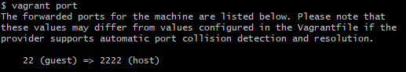
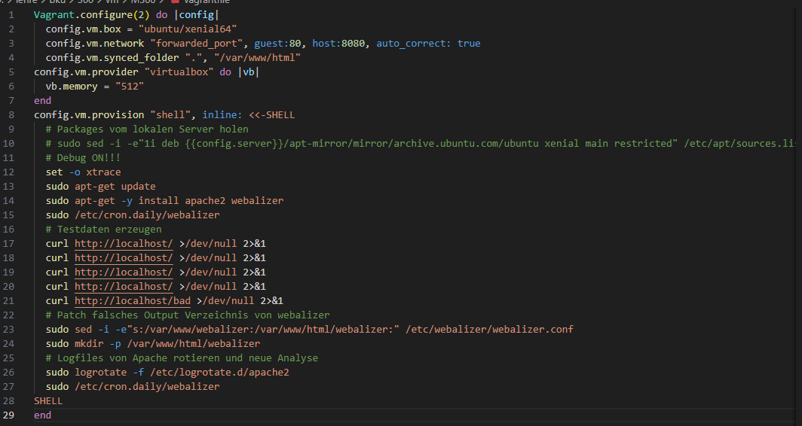
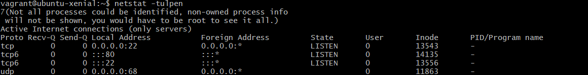
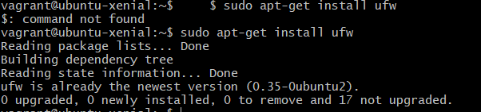

Dokumentation Modul 300

10 Toolumgebung
    1. Readme
        Zuerst habe ich einen GitHub-Account erstellt und ein öffentliches Repository angelegt. Zur sicheren Authentifizierung habe ich lokal einen SSH-Schlüssel mit
        ssh-keygen -t rsa -b 4096 -C "email@beispiel.ch"
        erstellt und den öffentlichen Schlüssel mit
        cat ~/.ssh/id_rsa.pub
        in meinem GitHub-Account hinterlegt.

        Anschliessend habe ich Git Bash installiert und Git mit meinen Benutzerdaten konfiguriert:
        git config --global user.name "username"
        git config --global user.email "email@beispiel.ch".
        Danach habe ich das Repository lokal geklont mit
        git clone git@github.com:<username>/<repository>.git.
        Änderungen habe ich mit
        git add -A,
        git commit -m "Kommentar"
        und
        git push
        in das GitHub-Repository hochgeladen.

        Danach habe ich VirtualBox installiert und eine Ubuntu-VM manuell erstellt. Das System habe ich mit
        sudo apt-get update
        sudo apt-get upgrade
        aktualisiert und neu gestartet. Anschliessend habe ich den Apache-Webserver mit
        sudo apt-get install apache2
        installiert und dessen Funktion im Browser unter
        http://127.0.0.1
        überprüft.

        Im nächsten Schritt habe ich Vagrant installiert, um virtuelle Maschinen automatisiert bereitzustellen. Ich habe eine VM mit
        vagrant init ubuntu/xenial64
        initialisiert und mit
        vagrant up
        gestartet. Der Zugriff auf die VM erfolgte über
        vagrant ssh.
        Die VM konnte ich mit
        vagrant destroy -f
        vollständig löschen. Mithilfe von Provisioning wurde der Apache-Webserver automatisch installiert und im Browser unter
        http://127.0.0.1:8080
        getestet.

        Zum Abschluss habe ich Visual Studio Code als Entwicklungsumgebung installiert.
        Ich habe die benötigten Extensions für Markdown, Vagrant und PDF hinzugefügt, das Git-Repository geöffnet,
        Dateien bearbeitet und Änderungen direkt aus Visual Studio Code oder über das Terminal mit Git committet und gepusht.
        VM-spezifische Ordner wie .vagrant habe ich in den Einstellungen ausgeschlossen, damit sie nicht ins Repository hochgeladen werden.

20 Infrastruktur

    1. Readme
        Arten von CLoud Computing:
            -IaaS: Infrastructur as a Service ist wenn man seine VMs und Infrastruktur selber managed.
            -PaaS: Platform as a Service ist wenn man die Maschine schon hat aber die Applikationen selber mitbringt.
            -SaaS: Software as a Service ist wenn man nicht mal die Applikation selber mitbringt sondern auch diese schon aus der Cloud nimmt.
            -CaaS: Container as a Service ist wenn man Container in der Cloud benutzt.

        Dynamic Infrastructur-Platform:   
            -Dynamic Infrastructur-Platform ist ein Service der Rechen-ressourcen virtuell bereitstellt und als VM dargestellt werden.
                -Z.B. CPU, Storage, networks 
            -Damit Infrastructur as Code funktionieren kann müssen folgende Anforderungen erfüllt werden: 
                -Porgrammierbar (API)
                -On demand (schnell ressourcen erstellen und löschen)
                -Selfservice (Ressourcen anpassen können)
                -Anbieter flexibel wechseln (AWS, Azure...)
            -Besispiele dafür sind:
            -Public Cloud: 
                -AWS 
                -Azure 
                -Digital Ocean 
                -Google 
                -exoscale
            -Private Cloud: 
                -Cloudstack 
                -Openstack
                -VMware vCloud
            -Lokale Virtualisierung
                -Oracle VirtualBox
                -Hyper-V
                -VMware Player
            -Hyperkonvergente Systeme
                -Rechner die die oben beschriebenen Eigenschaften in einer Hardware vereinen    

        Infrastructur as Code
            -IaC ist ein Paradigma (grundsätzliche Denkweise) zur Infrastruktur-automatisierung. 
            -Das heisst Infrastruktur wird konsistent, versioniert, getestet und automatisch ausgerollt.
            -Die Ziele von IaC sind:
                -Schnelle, sichere und wiederholbare Änderungen
                -Weniger manuelle Routinearbeit
                -Selbstständige Ressourcenerstellung
                -Schnelle Wiederherstellung bei Ausfällen
                -Kontinuierliche Verbesserung
            -Arten von Tools für IaC
                -Infrastructur Definition Tools
                    - Bereitstellung und Konfiguration einer Sammlung von Ressourcen
                    - Openstack, Terraform, Cloudformation
                -Server Configuration Tools
                    -Bereitstellung und Konfiguration von Servern
                    -Vagrant, Packer, Docker
                -Package Management Tools
                    -Bereitstellung und Verteilung von vorkonfigurierter Software
                    -APT, YUM, WiX, SBT native packager
                -Scripting Tools
                    -Komandozeileninpreter kurz CLI
                    -Bash, Powershell
                -Versionverwaltung und Hubs
                    -Versionskontrolle von Definitionsdateien und Ablage für Images
                    -Github, Vagrant Boxes, Docker Hub, Windows VM
            
        Vagrant
            -Zentrale Befehle
                -vagrant init, Initialisiert Vagrantfile
                -vagrant up, Erstellt und startet VM
                -vagrant ssh, SSH-Zugriff auf VM
                -vagrant status, Status der VM anzeigen
                -vagrant port, Weitergeleitete Ports anzeigen
                -vagrant halt, VM stoppen
                -vagrant destroy -f, VM löschen
 
            -Konfiguration (Vagrantfile)
                -Vagrant.configure("2") do |config|
                -config.vm.box = "bento/ubuntu-16.04"
                -config.vm.hostname = "srv-web"
                -config.vm.network :forwarded_port, guest: 80, host: 4567
                -end
 
            -Provisioning
                -Automatisierte Konfiguration der VM
                -Über Shell, Bash
                    -config.vm.provision :shell, inline: <<-SHELL
                    -sudo apt-get update
                    -sudo apt-get -y install apache2
                    -SHELL
 
            -Provider
                -Definiert die Plattformen
                    -config.vm.provider "virtualbox" do |vb|
                    -vb.memory = "512"
                    -end
 
            -Workflow
                -WM erstellen
                    -mkdir myserver
                    -cd myserver
                    -vagrant init ubuntu/xenial64
                    -vagrant up
                -WM aktualisieren
                    -vagrant provision
                    -# oder
                    -vagrant destroy -f
                    -vagrant up
                -VM löschen
                    -vagrant destroy -f
       
            -Synced Folders
                -Gemeinsamer Ordner zwischen Host und VM
                    -config.vm.synced_folder ".", "/var/www/html"

        -Reflexion
            -Cloud Computing ist Programme auf einem anderen Rechner aus der Ferne aus aufzurufen
            -DIP sind die Rechner die die Ressourcen bereitstellen für Cloud Computing
            -IaC funktioniert nur wenn folgende Anforderungen erfüllt sind:
                -Programmierbar
                -On-Demand
                -Self-Service
                -Portabel
                -Sicherheitsanforderungen    

    2. Fragen
        1. Was versteht man unter Cloud-Computing? 
                Wenn man Programme und Virtuelle Maschinen nicht auf dem lokalen Rechner installiert hat sondern auf einem anderen auf den vom lokalen Rechner zugegriffen wird.

        2. Was versteht man unter IaaS? 
                IaaS ist wenn man als User schon vorhandene Dienste in einem System verwaltet aber immer noch für die Virtuellen Maschinen selbst zuständig ist.
   
        3. Was ist der Unterschied zwischen Infrastructur as Code und der manuellen Installation der VM? 
                Es ist automatisiert und kann beliebig wiederholt werden. Ausserdem ist es besser Dokumentiert.
   
        4. Was wird mit Vagrant erzeugt?
                VMs
   
        5. Welche Aussage stimmt? 
                b) --> Vagrant erstellt virtuelle Maschinen, dabei werden mehrere HyperVisor und Cloud Umgebungen unterstützt.
   
        6. In welchen Bereich der Cloud Computing ist Vagrant einzuordnen? 
                IaaS weil es VMs managed
   
        7. Welche Alternativen zu Vagrant gibt es? 
                Lima, Packer Multipass oder virt-manager
  
        8.  Wo speichert Vagrant seine Konfiguration? 
                Vagrantfile
    
        9.  Was bedeutet die Fehlermeldung "A Vagrant environment or target machine is required to run this command."? 
                Dass in dem Verzeichnis in dem du bist keine VM ist.
  
        10. Bei welcher LPI Zertifizierung nützt mir das Vagrant Wissen? 
                Für diverse Zeritfikate für Linux Dev

    3. LB2.md
        -VM erstellen
            -folgende Commands ausführen um VM zu erstellen
                cd VM
                mkdir M300
                cd M300
                vagrant init ubuntu/xenial64
                vagrant up

        -VM mit SSH verbinden
            -folgenden Command eingeben um per SSH auf den Server zu kommen
                -vagrant ssh

        -Serverdienste auswählen
            -zuerst muss der Server die Paketquellen von Ubuntu aktualisieren
                -sudo apt-get update
            -Danach muss Apache und Webalyzer installiert werden mit folgenden Commands
                -sudo apt-get install -y apache2
                -sudo apt-get install -y webalizer 
 

           
            -Danach kann man mit history sehen welche Commands bisher eingegeben wurden.

            -Mit dem folgenden Befehl sieht man die freigegebenen Ports:
                -vagrant port

            
            -Man kann hier sehen dass nur der SSH Port fregegeben ist
            -Das heisst dass ich jetzt noch den Port 80 für Apache freigeben muss.
            -Mit dem folgenden Command öffnet sich das Vagrantfile im VS Code und ich kann es ersetzen.    
                -code vagrantfile
            -Da kopiere ich den Code aus der Anleitung herein

            
            -Damit das richtig geladen wird, muss ich noch die VM restarten mit folgenden Commands
                -vagrant reload
                -vagrant provision
            -Und zum nochmal testen führe ich nochmal den folgenden Command aus
                -vagrant port

            
            -Und mit Localhost:8080/webalizer kommt man dann auf die Webalizer Website

25 Sicherheit
    1. Fragen
        
        Firewall und Reverse Proxy

            -Was ist der Unterschied zwischen einem Web Server und einen Reverse Proxy?
               - Ein Webserver stellt HTML seiten direkt bereit. Der Reverse Proxy ist nur Vermittler von einem Webserver oder so
        
            -Was verstehen wir unter einer "White List"?
                -Eine Liste mit Elementen z.B. Servern denen man vertauen kann
        
            -Was wäre die Alternative zum Absichern der einzelnen Server mit einer Firewall?
                -Eine Firewall für alle
        
        SSH    
            
            -Was ist der Unterschied zwischen der id_rsa und id_rsa.pub Datei?
                -Der id_rsa ist der Privat Key und der id_rsa.pub ist ein Public Key
        
            -Wo darf ein SSH Tunnel nicht angewendet werden?
                -In einer Firma

            -Für was dient die Datei authorized_keys?
                -Es beinhaltet alle Public Keys der Leute die ohne Passwort auf das System dürfen.

            -Für was dient die Datei known_hosts?
                -Das ist eine Liste von Systemen an denen ich mich schon einmal mit SSH angemeldet habe.
    
    2. Readme
        -Installation Firewall
            -Als erstes habe ich mit dem folgenden Command die offenen Ports angeschaut
                -Netstat -tulpen

            -Danach habe ich die Installation gestartet mit dem folgenden Command
                -sudo apt-get install ufw

            -Danach kann ich die Firewall mit status auslesen ob sie an oder aus ist und mit enable/ disable an oder ausschalten
                -sudo ufw status
                -sudo ufw enable
                -sudo ufw disable

            -Danach bearbeite ich die Firewallregeln mit folgenden Commands:
                -vagrant ssh
                -sudo ufw allow 80/tcp
                -exit

                -vagrant ssh
                -sudo ufw allow from 192.168.178.87 to any port 22

        -Installation Reverse Proxy
            -Zuerst habe ich die zwei benötigen Module mit den folgenden Commands heruntergeladen
                -sudo apt-get install libapache2-mod-proxy-html
                -sudo apt-get install libxml2-dev

            -Danach habe ich die Module aktualisiert mit den folgenden Commands
                -sudo a2enmod proxy
                -sudo a2enmod proxy_html
                -sudo a2enmod proxy_http
     

            - Danach habe ich noch den Apache2 Service neu gestartet mit dem folgenden Command:
              - sudo service apache2 restart
            - 