---

# Dokumentation Modul 300


# 10 Toolumgebung


# 1. Readme
Zuerst habe ich einen GitHub-Account erstellt und ein öffentliches Repository angelegt. Zur sicheren Authentifizierung habe ich 
lokal einen SSH-Schlüssel erstellt und den öffentlichen Schlüssel in meinem GitHub-Account hinterlegt mit den folgenden Commands  
```bash
 ssh-keygen -t rsa -b 4096 -C "email@beispiel.ch"  
 cat ~/.ssh/id_rsa.pub
 ```


Anschliessend habe ich Git Bash installiert und Git mit meinen Benutzerdaten konfiguriert und das Repository geklont mit folgenden Commands    
```bash
git config --global user.name "username"  
git config --global user.email "email@beispiel.ch"  
git clone git@github.com:<username>/<repository>.git 
```

Änderungen habe ich mit danach ins GitHub-Repository hochgeladen mit folgenden Commands  
```bash
git add -A  
git commit -m "Kommentar" 
git push 
```

Danach habe ich VirtualBox installiert und eine Ubuntu-VM manuell erstellt. Das System habe ich aktualisiert und neu gestartet. Anschliessend habe ich den Apache-Webserver installiert und dessen Funktion im Browser unter  
http://127.0.0.1  
überprüft.  

```bash
sudo apt-get update 
sudo apt-get upgrade   
sudo apt-get install apache2
``` 


Im nächsten Schritt habe ich Vagrant installiert, um virtuelle Maschinen automatisiert bereitzustellen. Ich habe eine VM initialisiert und gestartet. Der Zugriff auf die VM erfolgte über ssh. Die VM konnte ich vollständig löschen. Mithilfe von Provisioning wurde der Apache-Webserver automatisch installiert und im Browser unter  
http://127.0.0.1:8080  getestet.  

```bash
`vagrant init ubuntu/xenial64`   
`vagrant up`   
`vagrant ssh`  
`vagrant destroy -f`  
```


Zum Abschluss habe ich Visual Studio Code als Entwicklungsumgebung installiert.  
Ich habe die benötigten Extensions für Markdown, Vagrant und PDF hinzugefügt, das Git-Repository geöffnet,  
Dateien bearbeitet und Änderungen direkt aus Visual Studio Code oder über das Terminal mit Git committet und gepusht.  
VM-spezifische Ordner wie .vagrant habe ich in den Einstellungen ausgeschlossen, damit sie nicht ins Repository hochgeladen werden.  

---

# 20 Infrastruktur

# 1. Readme
Arten von CLoud Computing:  
`-IaaS:` Infrastructur as a Service ist wenn man seine VMs und Infrastruktur selber managed.  
`-PaaS:` Platform as a Service ist wenn man die Maschine schon hat aber die Applikationen selber mitbringt.  
`-SaaS:` Software as a Service ist wenn man nicht mal die Applikation selber mitbringt sondern auch diese schon aus der Cloud nimmt.  
`-CaaS:` Container as a Service ist wenn man Container in der Cloud benutzt.  

---

## Dynamic Infrastructur-Platform:   
Dynamic Infrastructur-Platform ist ein Service der Rechen-ressourcen virtuell bereitstellt und als VM dargestellt werden.  
Z.B. CPU, Storage, networks   
Damit Infrastructur as Code funktionieren kann müssen folgende Anforderungen erfüllt werden:  
- Porgrammierbar (API)  
- On demand (schnell ressourcen erstellen und löschen)  
- Selfservice (Ressourcen anpassen können)  
- Anbieter flexibel wechseln (AWS, Azure...)   

---

## Besispiele dafür sind:  
### Public Cloud:   
- AWS  
- Azure  
- Digital Ocean  
- Google  
- exoscale  
### Private Cloud:  
- Cloudstack   
- Openstack  
- VMware vCloud  
### Lokale Virtualisierung  
- Oracle VirtualBox  
- Hyper-V  
- VMware Player  
### Hyperkonvergente Systeme  
- Rechner die die oben beschriebenen Eigenschaften in einer Hardware vereinen    

---

## Infrastructur as Code  
- IaC ist ein Paradigma (grundsätzliche Denkweise) zur Infrastruktur-automatisierung.   
- Das heisst Infrastruktur wird konsistent, versioniert, getestet und automatisch ausgerollt.  
### Die Ziele von IaC sind:  
- Schnelle, sichere und wiederholbare Änderungen  
- Weniger manuelle Routinearbeit  
- Selbstständige Ressourcenerstellung  
- Schnelle Wiederherstellung bei Ausfällen  
- Kontinuierliche Verbesserung  
### Arten von Tools für IaC  
#### Infrastructur Definition Tools  
- Bereitstellung und Konfiguration einer Sammlung von Ressourcen  
- Openstack, Terraform, Cloudformation  
#### Server Configuration Tools  
- Bereitstellung und Konfiguration von Servern  
- Vagrant, Packer, Docker  
#### Package Management Tools  
- Bereitstellung und Verteilung von vorkonfigurierter Software  
- APT, YUM, WiX, SBT native packager  
#### Scripting Tools  
- Komandozeileninpreter kurz CLI  
- Bash, Powershell  
#### Versionverwaltung und Hubs  
- Versionskontrolle von Definitionsdateien und Ablage für Images  
- Github, Vagrant Boxes, Docker Hub, Windows VM  

 ---

## Vagrant  
### Zentrale Befehle  

```bash
vagrant init #Initialisiert Vagrantfile
vagrant up #Erstellt und startet VM
vagrant ssh #SSH-Zugriff auf VM
vagrant status #Status der VM anzeigen
vagrant port #Weitergeleitete Ports anzeigen
vagrant halt #VM stoppen
vagrant destroy -f #VM löschen
```  
 
### Konfiguration (Vagrantfile)  

```bash
Vagrant.configure("2") do |config|
config.vm.box = "bento/ubuntu-16.04"
config.vm.hostname = "srv-web"
config.vm.network :forwarded_port, guest: 80, host: 4567
end
```  
 
### Provisioning  
- Automatisierte Konfiguration der VM  
- Über Shell, Bash  
```bash
config.vm.provision :shell, inline: #<<-SHELL
sudo apt-get update
sudo apt-get -y install apache2
```  
 
### Provider  
Definiert die Plattformen  
```bash
config.vm.provider "virtualbox" do |vb|
vb.memory = "512"
end
```  
 
---

## Workflow  
### WM erstellen  
```bash
mkdir myserver
cd myserver
vagrant init ubuntu/xenial64
vagrant up
```  
### WM aktualisieren  
```bash
vagrant provision
# oder
vagrant destroy -f
vagrant up
```  
### VM löschen
```bash
vagrant destroy -f
```       
### Synced Folders
Gemeinsamer Ordner zwischen Host und VM
```bash
config.vm.synced_folder ".", "/var/www/html"
```

---

## Reflexion  
### Cloud Computing ist Programme auf einem anderen Rechner aus der Ferne aus aufzurufen  
### DIP sind die Rechner die die Ressourcen bereitstellen für Cloud Computing  
### IaC funktioniert nur wenn folgende Anforderungen erfüllt sind:  
- Programmierbar  
- On-Demand  
- Self-Service  
- Portabel  
- Sicherheitsanforderungen    

---

# 2. Fragen
### Was versteht man unter Cloud-Computing?
- Wenn man Programme und Virtuelle Maschinen nicht auf dem lokalen Rechner installiert hat sondern auf einem anderen auf den vom lokalen Rechner zugegriffen wird.  

### Was versteht man unter IaaS?
- IaaS ist wenn man als User schon vorhandene Dienste in einem System verwaltet aber immer noch für die Virtuellen Maschinen selbst zuständig ist.  
   
### Was ist der Unterschied zwischen Infrastructur as Code und der manuellen Installation der VM?
- Es ist automatisiert und kann beliebig wiederholt werden. Ausserdem ist es besser Dokumentiert.  
   
### Was wird mit Vagrant erzeugt?
- VMs  
   
### Welche Aussage stimmt?
- b) --> Vagrant erstellt virtuelle Maschinen, dabei werden mehrere HyperVisor und Cloud Umgebungen unterstützt.  
   
### In welchen Bereich der Cloud Computing ist Vagrant einzuordnen?
- IaaS weil es VMs managed  
   
### Welche Alternativen zu Vagrant gibt es?
- Lima, Packer Multipass oder virt-manager  
  
### Wo speichert Vagrant seine Konfiguration?
- Vagrantfile  
    
### Was bedeutet die Fehlermeldung "A Vagrant environment or target machine is required to run this command."?
- Dass in dem Verzeichnis in dem du bist keine VM ist.  
  
### Bei welcher LPI Zertifizierung nützt mir das Vagrant Wissen?
- Für diverse Zeritfikate für Linux Dev  

---

# 3. LB2.md  
## VM erstellen  
- folgende Commands ausführen um VM zu erstellen  
```bash
cd VM
mkdir M300
cd M300
vagrant init ubuntu/xenial64
vagrant up
```  


---

## VM mit SSH verbinden  
- folgenden Command eingeben um per SSH auf den Server zu kommen    
```bash
vagrant ssh
```  
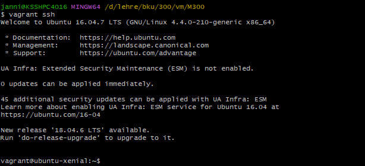

---

## Serverdienste auswählen  
- zuerst muss der Server die Paketquellen von Ubuntu aktualisieren  
```bash
sudo apt-get update
```  
- Danach muss Apache und Webalyzer installiert werden mit folgenden Commands  
```bash
sudo apt-get install -y apache2
sudo apt-get install -y webalizer 
```
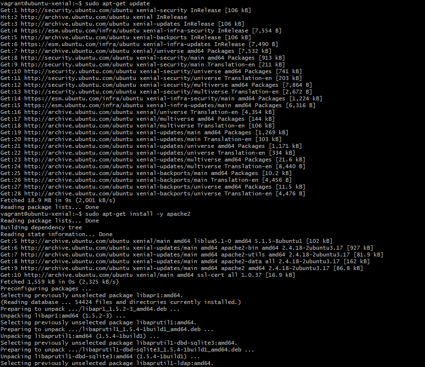 

           
- Danach kann man mit history sehen welche Commands bisher eingegeben wurden.  


- Mit dem folgenden Befehl sieht man die freigegebenen Ports:  
```bash
vagrant port
```

            
- Man kann hier sehen dass nur der SSH Port fregegeben ist  
- Das heisst dass ich jetzt noch den Port 80 für Apache freigeben muss.  
- Mit dem folgenden Command öffnet sich das Vagrantfile im VS Code und ich kann es ersetzen.     
```bash
code vagrantfile
```
- Da kopiere ich den Code aus der Anleitung herein  
  

            
- Damit das richtig geladen wird, muss ich noch die VM restarten mit folgenden Commands  
```bash
vagrant reload
vagrant provision
```  
- Und zum nochmal testen führe ich nochmal den folgenden Command aus  
```bash
vagrant port
```  
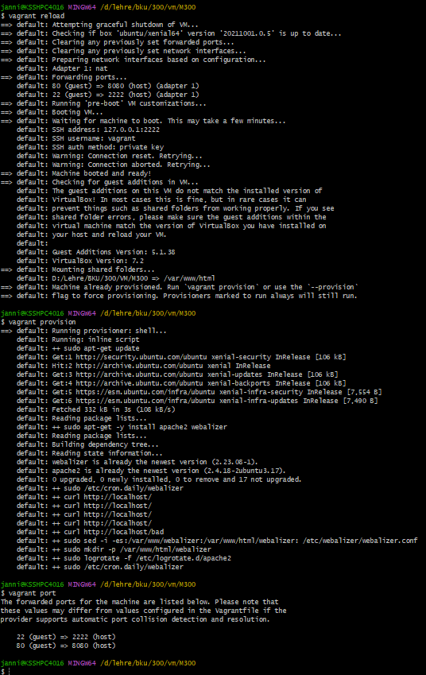
            
- Und mit Localhost:8080/webalizer kommt man dann auf die Webalizer Website  
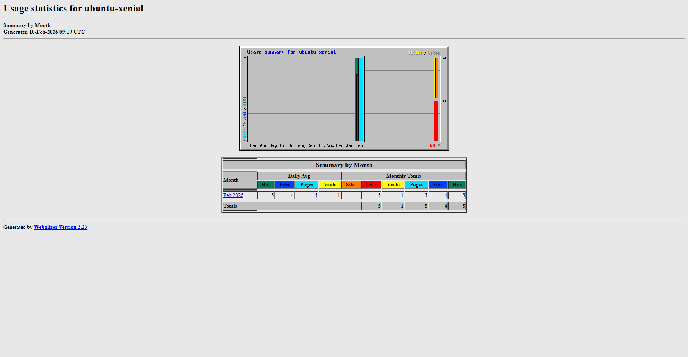

---

# 25 Sicherheit  
# 1. Fragen  
        
## Firewall und Reverse Proxy  

### Was ist der Unterschied zwischen einem Web Server und einen Reverse Proxy?
- Ein Webserver stellt HTML seiten direkt bereit. Der Reverse Proxy ist nur Vermittler von einem Webserver oder so  
        
### Was verstehen wir unter einer "White List"?
- Eine Liste mit Elementen z.B. Servern denen man vertauen kann  
        
### Was wäre die Alternative zum Absichern der einzelnen Server mit einer Firewall?
- Eine Firewall für alle  

---

## SSH  
            
### Was ist der Unterschied zwischen der id_rsa und id_rsa.pub Datei?
- Der id_rsa ist der Privat Key und der id_rsa.pub ist ein Public Key  
        
### Wo darf ein SSH Tunnel nicht angewendet werden?
- In einer Firma  

### Für was dient die Datei authorized_keys?
- Es beinhaltet alle Public Keys der Leute die ohne Passwort auf das System dürfen.  

### Für was dient die Datei known_hosts?
- Das ist eine Liste von Systemen an denen ich mich schon einmal mit SSH angemeldet habe.  

---

# 2. Readme
# Installation Firewall
- Als erstes habe ich mit dem folgenden Command die offenen Ports angeschaut  
```bash
-Netstat -tulpen
```  


- Danach habe ich die Installation gestartet mit dem folgenden Command  
```bash                
sudo apt-get install ufw
```  


- Danach kann ich die Firewall mit status auslesen ob sie an oder aus ist und mit enable/ disable an oder ausschalten  
```bash
sudo ufw status
sudo ufw enable
sudo ufw disable
```  
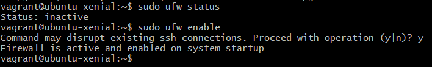

- Danach bearbeite ich die Firewallregeln mit folgenden Commands:  
```bash
vagrant ssh
sudo ufw allow 80/tcp
sudo ufw allow from 192.168.178.87 to any port 22
```  


---

# Installation Reverse Proxy
- Zuerst habe ich die zwei benötigen Module mit den folgenden Commands heruntergeladen
```bash
sudo apt-get install libapache2-mod-proxy-html
sudo apt-get install libxml2-dev
```

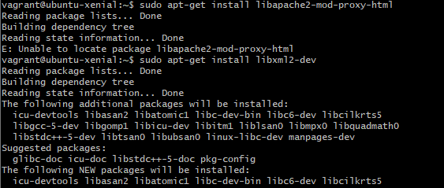

- Danach habe ich die Module aktualisiert mit den folgenden Commands
```bash
sudo a2enmod proxy
sudo a2enmod proxy_html
sudo a2enmod proxy_http
```

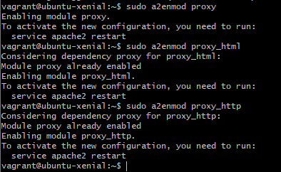     

- Danach habe ich noch den Apache2 Service neu gestartet mit dem folgenden Command:
```bash
sudo service apache2 restart
```

---

# 30-Container 
# Fragen.md


## Container
 
### Was ist der Unterschied zwischen Vagrant und Docker?
- Vagrant ist IaaS und Docker PaaS
 
### Welches Tools aus dem Docker Universum ist Vergleichbar mit Vagrant?
- Docker Machine
 
### Was macht der Docker Provisioner von Vagrant?
-  Es installiert Docker in einer VM
 
### Welche Linux Kernel Funktionalität verwenden Container?
- Linux Namespaces          

### Welches Architekturmuster verwendet der Entwickler wenn er Container einsetzt?
- Microservices
 
### Welches sind die drei Hauptmerkmale (abgeleitet vom Ur-Unix) von Microservices?
- Eine Aufgabe pro Porgramm
- Zusammenarbeit zwischen Programmen
- Eine Universielle Schnistelle
 
---
 
## Docker
 
### Was ist der Unterschied zwischen einem Docker Image und einem Container?
-   Image = gebuildet, Container Image = aktuelle Änderungen im Filesystem
 
### Was ist der Unterschied zwischen einer Virtuellen Maschine und einem Docker Container?
- Docker ist nur die Plattform (PaaS), z.B Apache als Webserver, VM hat noch das OS.
 
### Wie bekomme ich Informationen zu einem laufenden Docker Container?
-Docker Inspect, Docker-logs
 
### Was ist der Unterschied zwischen einer Docker Registry und einem Repository
- Das Registry speichert Images und das Repository die verschieden Versionen vom Image
 
### Wie erstelle ich ein Container Image
- Docker build
 
### In welcher Datei steht welche Inhalte sich im Container Image befinden?
- Dockerfile
 
### Der erste Prozess im Container bekommt die Nummer?
- 1
 
### Welche Teile von Docker sind durch Kubernetes obsolet geworden, bzw. sollten nicht mehr verwendet werden?
- Compose, Swarm, Volumes und Network 
 
### Welche Aussage ist besser
 
#### A: Dockerfile sollten möglichst das Builden (CI) und Ausführen von Services beinhalten, so ist alles an einem Ort und der Entwickler kann alles erledigen.
 
#### B: Das Builden und Ausführen von Services ist strikt zu trennen. Damit saubere und nachvollziehbare Services mittels CI/CD Prozess entstehen.
- Aussage B
 
---
 
## Docker Hub
 
### Was ist Docker Hub?
- Ein Container Registry, dass Images gespeichert werden
 
### Welches sind die Alternativen?
- Eigentlich alle Cloud-Anbieter stellen heutzutage ein Container Registry zu verfügung
 
### Warum sollte eine eigene Docker Registry im Unternehmen verwendet werden?
- alle Images sind zentral übereacht, gleiche Quelle, Sicherheit  
 
### Warum sollten Versionen tag von Images immer angegeben werden?
- Damit nicht immer das neueste verwendet wird
 
### Was ist der Unterschied zwischen Docker save/Docker load und Docker export/Docker import?
- save/load --> Image, export/import --> Container  

---

# Readme
## Container

- Container verändern Softwareentwicklung, -verteilung und -betrieb  
- Gleiche Laufzeitumgebung lokal, on-premise und in der Cloud  
- Weniger Konfigurationsaufwand für Administratoren   
- Fokus auf Netzwerk, Ressourcen und Verfügbarkeit  

### Merkmale von Containern
- Teilen Ressourcen mit dem Host-Betriebssystem  
- Sehr schneller Start und Stopp  
- Geringer bis kein Overhead  
- Hohe Portabilität   
- Leichtgewichtig, viele parallel möglich  
- Cloud-fähig  

### Geschichte
- chroot: frühe Dateisystem-Isolation  
- FreeBSD Jails: Prozess-Isolation  
- Solaris Zones: umfassende Containerisierung  
- Virtuozzo / OpenVZ  
- Google: Einführung von cgroups   
- LXC: Kombination mehrerer Container-Techniken  
- Docker: Durchbruch und Mainstream  

### Microservices  
- Wichtiger Anwendungsfall für Container  
- Kleine, unabhängige Dienste  
- Kommunikation über Netzwerk  
- Gegensatz zu monolithischen Anwendungen  
- Horizontale Skalierung  
- Gezielte Ressourcennutzung  
- Weniger Ressourcenverschwendung  

---

## Docker  
### Überblick  
- Baut auf Linux-Containertechnologien auf  
- Erweiterung durch portable Images & einfache Bedienung  
- Lösung zum Erstellen, Verteilen und Ausführen von Containern  
- Besteht aus -Docker Engine --> Container bauen & Ausführen, -Docker Hub --> Clouddienst für Imageverteilung  
- Entwickelt für 64-bit Linux  
- Nutzung auf macOS & Windows via VirtualBox  

### Architektur  
#### Docker Daemon  
- Erstellt, startet, überwacht Container  
- Baut & speichert Images  
- Läuft als Dienst auf dem Host-System   
  
#### Docker Client
- Bedienung über CLI  
- Kommunikation mit Daemon via HTTP REST  
- Verbindung zu lokalen & entfernten Daemons möglich  

#### Images
- Unveränderbare, gebaute Umgebungen  
- Startbar als Container  
- Bestehen aus Name + Tag  
- Standard-Tag: latest   

#### Container  
- Laufende Instanzen von Images  
- Ein Image --> mehrere Container möglich  
- Änderungen per Union File System gespeichert  

#### Docker Registry  
- Speicherort für Images  
- Standard: Docker Hub  
- Öffentliche & offizielle Images  
- Private Registries für Firmen  
 
### Befehle  
#### Docker run  
- startet neue Container  
- Konfiguration von Laufzeit, Ressourcen, Netzwerken   
- Beispiele  
```bash
docker run hello-world
docker run -it ubuntu /bin/bash
docker run -d ubuntu sleep 20
docker run -d --rm ubuntu sleep 20
docker run -d ubuntu touch /tmp/lock
docker run -d ubuntu ls -l
```  

#### Docker ps  
- zeigt Container Übersicht  
```bash
docker ps #zeigt aktive Container
docker ps -a #zeigt alle Container
docker ps -a -q #zeigt nur die IDs
```  

#### Docker images  
- Listet lokale Images  
```bash
docker images
#oder
docker image ls
```  

#### Docker rm  
- Löscht Container  
```bash
docker rm [Containername] #bestimmte Container löschen
docker rm `docker ps -a -q` #Alle beendeten Container löschen
docker rm -f `docker ps -a -q` #Alle Container löschen auch aktive
```  

#### Docker rmi
- Löscht Images  
```bash
docker rmi ubuntu #Docker image löschen
docker rmi `docker images -q -f dangling=true` #Zwischenimages löschen (ohne Namen)
```  

#### Docker start
- startet gestoppte Container (nach erstellung oder nach stoppen)  
```bash
 docker start [id]
 ```  

 #### Docker stop
 - Stoppt Container (Status:exited)  
```bash 
docker stop
```  

#### Docker kill
- beendet Container sofort  
```bash
docker kill
```  
 
#### Docker logs
- gibt die Logs eines Containers aus  
```bash
 docker logs
 ```  

 #### Docker inspect  
- ausgabe von wichtigen informationen über einen Container  
```bash
docker inspect
```  

#### Docker diff
- gibt alle unterschiede des Images jetzt und mit dem dass zum starten genutzt wurde  
```bash
docker diff 
```  
  
#### Docker top
- Gibt informationen zu laufenden Prozessen im Container an  
```bash
docker top
```  

#### Docker build
- Baut Images aus einem Dockefile  
```bash  
docker build -t mysql .   
```

#### Docker exec
- Führt einen Befehl im laufenden Container aus  
```bash
docker exec -it mysql bash
```  

### Dockerfile
- Textdatei zur erstellung eines Images  
- Bauen mit `docker build`  
- starten mit `docker run`  

 
### Konzepte  

#### Build konzepte  
- Dateien/Verzeichnisse für `ADD` & `COPY`  
- Meist ein Verzeichnis  

#### Layer(Imageschichten)  
- Jede Dockerfile-Anweisung = neuer Layer  
- Wiederverwendbar & cachebar  


#### Dockerfile Anweisungen  
- FROM – Base Image  
- ADD – Dateien/URLs ins Image kopieren  
- CMD – Standardbefehl beim Start  
- COPY – Dateien aus Build Context kopieren  
- ENTRYPOINT – Hauptprozess des Containers  
- ENV – Umgebungsvariablen setzen  
- EXPOSE – Dokumentiert offene Ports  
- HEALTHCHECK – Prüft Container-Zustand  
- MAINTAINER – Autor-Metadaten  
- RUN – Befehle beim Build ausführen  
- SHELL – Definiert Shell für RUN  
- USER – Setzt Benutzer  
- VOLUME – Deklariert Volumes  
- WORKDIR – Arbeitsverzeichnis setzen  

---

## Image bereitstellung

### Allgemein  
- Images bereitstellen für: Kollegen, CI-Server, Endanwender  
- Über: `Docker build`, `docker pull`, `docker load`, `docker save`  

### Namensgebung von Images  
- Format: name:tag  
- Kein Tag --> automatisch latest  
- setzen mit   
```bash
docker build -t name .
docker tag image username/image
```  
- wichtig für sauberen Entwicklungs-Workflow  
##### Regeln für Tags:  
- Bustaben und Zahlen und . und -   
- max 128 Zeichen  
- nicht starten mit . oder -  

### Achtung latest  
- `latest` = nur Default-Tag, keine technische Bedeutung  
- Oft als aktuelle Version genutzt, aber nicht garantiert  
- `docker pull/run image` ohne Tag → nutzt `:latest`  

### Docker Hub  
- Offizielle Online-Registry von Docker   
- Öffentliche Repositories kostenlos  
- Private Repositories kostenpflichtig  
- Vorteile: einfache Verteilung von Images  

### Docker Hub Workflow  
- Account erstellen  
- Image taggen: `docker tag mysql username/mysql`  
- Image hochladen: `docker push username/mysql`  
- Image im Web-Dashboard beschreiben  
- Suchen: `docker search mysql`  
- Download: `docker pull ubuntu`  
  
### Import / Export ohne Registry  
##### Container  
- Export: `docker export container -o file.tar`  
- Import (ergibt Image): `docker import file.tar name`  


##### Images  
- Anzeigen: `docker images`  
- Sichern: `docker save image -o image.tar`  
- Wiederherstellen: `docker load -i image.tar`  


### Private Registry  
##### Alternativen zu Docker Hub:  
- Manuell export/import --> Fehleranfällig  
- Neu bauen aus Dockerfiles --> langsam & inkonsistent  
  
##### Private Registry einrichten  
Image laden: `docker pull registry:2`
Starten: `docker run -d -p 5000:5000 --restart=always --name registry \ -v /var/spool/docker-registry:/var/lib/registry registry:2`


##### Docker Client konfigurieren  
- bei /etc/docker/daemon.json folgendes eingeben  
```bash
{ "insecure-registries":["SERVER:5000"] }
```
- Docker neu starten  


##### Verwendung  
- Pull: `docker pull SERVER:5000/ubuntu`  
- Push: `docker tag ubuntu SERVER:5000/myubuntu`  
   `docker push SERVER:5000/myubuntu`

---

# LB3

## Docker Container erstellen

### VM vorbereiten
- Als erstes habe ich eine neue VM erstellt mit Vagrant mit den folgenden Codes
```bash
vagrant init ubuntu/xenial64
vagrant up
code vagrantfile
```

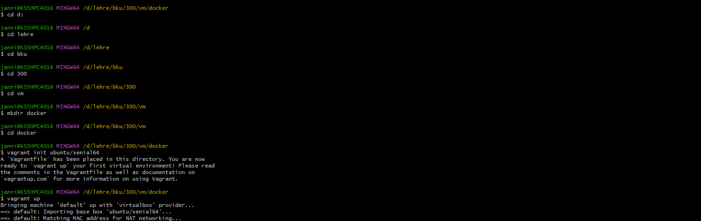

- Danach habe ich den vorgegebenen Inhalt hineinkopiert und die folgenden Commands ausgeführt
```bash
vagrant reload
vagrant provision
```

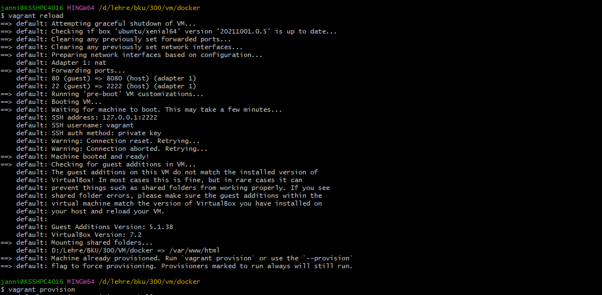

---

### Docker installieren
- Um docker zu installieren muss ich mit ssh auf den Server und dann die folgenden Commands ausführen
```bash
sudo apt-get update
sudo apt-get -y install docker.io
sudo systemctl enable --now docker
sudo systemctl status docker
```
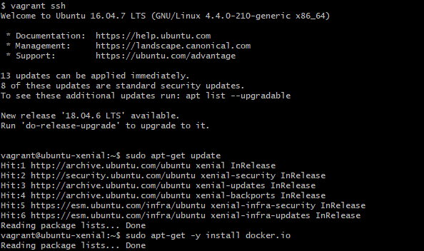
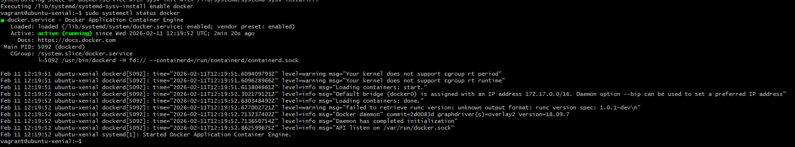

---

### Dockerfile erstellen
- Im normalen Dash den folgenden Code eingeben und in die Datei die sich geöffnet hat den vorgegebenen code kopieren.
```bash
code Dockerfile
```

- Danach habe ich mich wieder mit ssh darauf verbunden und den folgenden Command ausgeführt um ein neues Image zu erstellen
```bash
docker build -t apache -image .
```

- Allerdings hat das nicht ganz funktioniert und es kam folgende Fehlermeldung  
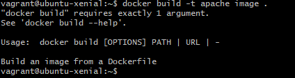

- Ich habe dann herausgefunden dass ich in der VM noch ein Dockerfile und ein htmlfile bearbeiten muss. Mit den folgenden Commands kann ich sie bearbeiten
```bash
nano dockerfile
nano index.html
```

- Da habe ich in die Dateien folgende Sachen reinkopiert
```bash
#In die index.html Datei
<h1>Apache läuft im Docker Container 🚀</h1>
<p>Erstellt in einer Vagrant VM</p>

#In das Dockerfile
FROM httpd:2.4

COPY index.html /usr/local/apache2/htdocs/index.html

EXPOSE 80
```
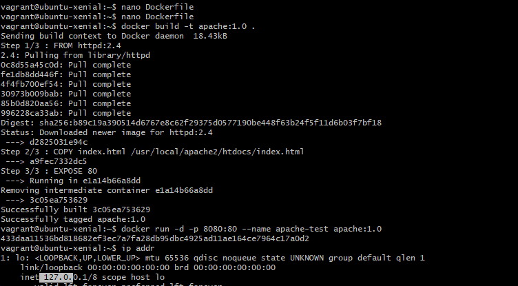

- Als das funktioniert hat musste ich immer alle Commands mit sudo eingeben. Deshalb habe ich die folgenden Commands ausgeführt damit ich das als normaler User auch kann
```bash
sudo usermod -aG docker vagrant
exit
vagrant ssh
```

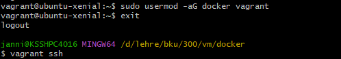

- Danach habe ich mit folgenden Commands endlich das Image und den Container bauen können
```bash
docker build -t apache:1.0 .
docker run -d -p 8080:80 --name apache-test apache:1.0
http://(http://127.0.0.1/):8080
```
- Danach erscheint Apache auf der Website

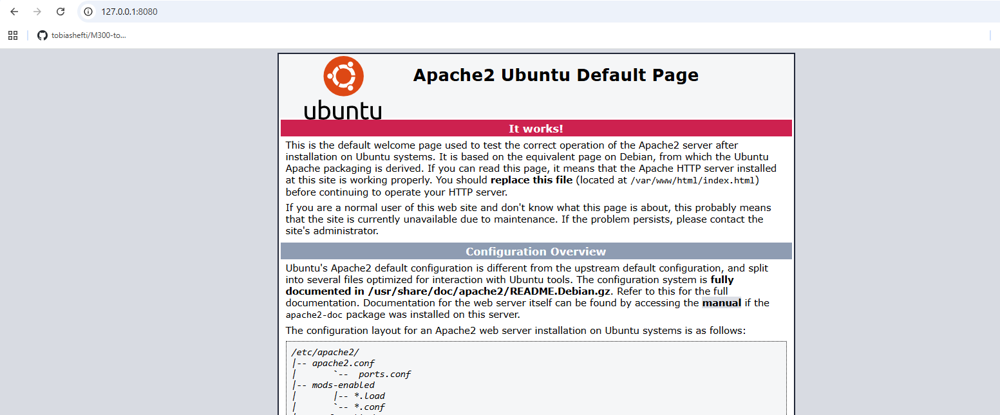
