---

# Inhaltsverzeichnis

- [10 Toolumgebung](#10-toolumgebung)
    - [1. Readme](#1-readme)
- [20 Infrastruktur](#20-infrastruktur)
    - [1. Readme](#1-readme-1)
    - [2. Fragen](#2-fragen)
    - [3. LB2.md](#3-lb2md)
- [25 Sicherheit](#25-sicherheit)
    - [1. Fragen](#1-fragen)
    - [2. Readme](#2-readme)
- [30 Container](#30-container)
    - [Fragen.md](#fragenmd)
    - [Readme](#readme)
    - [LB3](#lb3)
- [35 Sicherheit](#35-sicherheit)
    - [Readme](#readme-1)
    - [Fragen](#fragen)
- [40 Kubernetes](#40-kubernetes)
    - [Readme](#readme-2)
    - [Fragen](#fragen-1)
- [50 Projekt](#50-projekt)
    - [Beschreibung](#beschreibung)
    - [Erstellung](#erstellung)
    - [Verzeichnis erstellen](#verzeichnis-erstellen)
    - [Troubleshoot Metrics](#troubleshoot-metrics)
    - [Dashboard erstellen](#dashboard-erstellen)
    - [Mehrspieler Testen](#mehrspieler-testen)

---

# Dokumentation Modul 300


# 10 Toolumgebung


# 1. Readme
Zuerst habe ich einen GitHub-Account erstellt und ein öffentliches Repository angelegt. Zur sicheren Authentifizierung habe ich 
lokal einen SSH-Schlüssel erstellt und den öffentlichen Schlüssel in meinem GitHub-Account hinterlegt mit den folgenden Commands  
```bash
 ssh-keygen -t rsa -b 4096 -C "email@beispiel.ch"  
 cat ~/.ssh/id_rsa.pub
 ```


Anschliessend habe ich Git Bash installiert und Git mit meinen Benutzerdaten konfiguriert und das Repository geklont mit folgenden Commands    
```bash
git config --global user.name "username"  
git config --global user.email "email@beispiel.ch"  
git clone git@github.com:<username>/<repository>.git 
```

Änderungen habe ich mit danach ins GitHub-Repository hochgeladen mit folgenden Commands  
```bash
git add -A  
git commit -m "Kommentar" 
git push 
```

Danach habe ich VirtualBox installiert und eine Ubuntu-VM manuell erstellt. Das System habe ich aktualisiert und neu gestartet. Anschliessend habe ich den Apache-Webserver installiert und dessen Funktion im Browser unter  
http://127.0.0.1  
überprüft.  

```bash
sudo apt-get update 
sudo apt-get upgrade   
sudo apt-get install apache2
``` 


Im nächsten Schritt habe ich Vagrant installiert, um virtuelle Maschinen automatisiert bereitzustellen. Ich habe eine VM initialisiert und gestartet. Der Zugriff auf die VM erfolgte über ssh. Die VM konnte ich vollständig löschen. Mithilfe von Provisioning wurde der Apache-Webserver automatisch installiert und im Browser unter  
http://127.0.0.1:8080  getestet.  

```bash
`vagrant init ubuntu/xenial64`   
`vagrant up`   
`vagrant ssh`  
`vagrant destroy -f`  
```


Zum Abschluss habe ich Visual Studio Code als Entwicklungsumgebung installiert.  
Ich habe die benötigten Extensions für Markdown, Vagrant und PDF hinzugefügt, das Git-Repository geöffnet,  
Dateien bearbeitet und Änderungen direkt aus Visual Studio Code oder über das Terminal mit Git committet und gepusht.  
VM-spezifische Ordner wie .vagrant habe ich in den Einstellungen ausgeschlossen, damit sie nicht ins Repository hochgeladen werden.  

---

# 20 Infrastruktur

# 1. Readme
Arten von Cloud Computing:  
`-IaaS:` Infrastructure as a Service ist, wenn man seine VMs und Infrastruktur selber managed.  
`-PaaS:` Platform as a Service ist, wenn man die Maschine schon hat aber die Applikationen selber mitbringt.  
`-SaaS:` Software as a Service ist, wenn man nicht mal die Applikation selber mitbringt sondern auch diese schon aus der Cloud nimmt.  
`-CaaS:` Container as a Service ist, wenn man Container in der Cloud benutzt.  

---

## Dynamic Infrastructure-Platform:   
Dynamic Infrastructure-Platform ist ein Service der Rechenressourcen virtuell bereitstellt und als VM dargestellt werden.  
Z.B. CPU, Storage, networks   
Damit Infrastructure as Code funktionieren kann müssen folgende Anforderungen erfüllt werden:  
- Programmierbar (API)  
- On demand (schnell ressourcen erstellen und löschen)  
- Selfservice (Ressourcen anpassen können)  
- Anbieter flexibel wechseln (AWS, Azure...)   

---

## Beispiele dafür sind:  
### Public Cloud:   
- AWS  
- Azure  
- Digital Ocean  
- Google  
- exoscale  
### Private Cloud:  
- Cloudstack   
- Openstack  
- VMware vCloud  
### Lokale Virtualisierung  
- Oracle VirtualBox  
- Hyper-V  
- VMware Player  
### Hyperkonvergente Systeme  
- Rechner die die oben beschriebenen Eigenschaften in einer Hardware vereinen    

---

## Infrastructure as Code  
- IaC ist ein Paradigma (grundsätzliche Denkweise) zur Infrastruktur-automatisierung.   
- Das heisst Infrastruktur wird konsistent, versioniert, getestet und automatisch ausgerollt.  
### Die Ziele von IaC sind:  
- Schnelle, sichere und wiederholbare Änderungen  
- Weniger manuelle Routinearbeit  
- Selbstständige Ressourcenerstellung  
- Schnelle Wiederherstellung bei Ausfällen  
- Kontinuierliche Verbesserung  
### Arten von Tools für IaC  
#### Infrastructure Definition Tools  
- Bereitstellung und Konfiguration einer Sammlung von Ressourcen  
- Openstack, Terraform, Cloudformation  
#### Server Configuration Tools  
- Bereitstellung und Konfiguration von Servern  
- Vagrant, Packer, Docker  
#### Package Management Tools  
- Bereitstellung und Verteilung von vorkonfigurierter Software  
- APT, YUM, WiX, SBT native packager  
#### Scripting Tools  
- Kommandozeileninterpreter kurz CLI  
- Bash, Powershell  
#### Versionverwaltung und Hubs  
- Versionskontrolle von Definitionsdateien und Ablage für Images  
- Github, Vagrant Boxes, Docker Hub, Windows VM  

 ---

## Vagrant  
### Zentrale Befehle  

```bash
vagrant init 
vagrant up 
vagrant ssh 
vagrant status 
vagrant port 
vagrant halt 
vagrant destroy -f 
```  
 
### Konfiguration (Vagrantfile)  

```bash
Vagrant.configure("2") do |config|
config.vm.box = "bento/ubuntu-16.04"
config.vm.hostname = "srv-web"
config.vm.network :forwarded_port, guest: 80, host: 4567
end
```  
 
### Provisioning  
- Automatisierte Konfiguration der VM  
- Über Shell, Bash  
```bash
config.vm.provision :shell, inline: 
sudo apt-get update
sudo apt-get -y install apache2
```  
 
### Provider  
Definiert die Plattformen  
```bash
config.vm.provider "virtualbox" do |vb|
vb.memory = "512"
end
```  
 
---

## Workflow  
### VM erstellen  
```bash
mkdir myserver
cd myserver
vagrant init ubuntu/xenial64
vagrant up
```  
### VM aktualisieren  
```bash
vagrant provision
# oder
vagrant destroy -f
vagrant up
```  
### VM löschen
```bash
vagrant destroy -f
```       
### Synced Folders
Gemeinsamer Ordner zwischen Host und VM
```bash
config.vm.synced_folder ".", "/var/www/html"
```

---

## Reflexion  
### Cloud Computing ist Programme auf einem anderen Rechner aus der Ferne aus aufzurufen  
### DIP sind die Rechner die die Ressourcen bereitstellen für Cloud Computing  
### IaC funktioniert nur wenn folgende Anforderungen erfüllt sind:  
- Programmierbar  
- On-Demand  
- Self-Service  
- Portabel  
- Sicherheitsanforderungen    

---

# 2. Fragen
### Was versteht man unter Cloud-Computing?
- Wenn man Programme und Virtuelle Maschinen nicht auf dem lokalen Rechner installiert hat sondern auf einem anderen auf den vom lokalen Rechner aus zugegriffen wird.  

### Was versteht man unter IaaS?
- IaaS ist wenn man als User schon vorhandene Dienste in einem System verwaltet aber immer noch für die Virtuellen Maschinen selbst zuständig ist.  
   
### Was ist der Unterschied zwischen Infrastructure as Code und der manuellen Installation der VM?
- Es ist automatisiert und kann beliebig wiederholt werden. Ausserdem ist es besser Dokumentiert.  
   
### Was wird mit Vagrant erzeugt?
- VMs  
   
### Welche Aussage stimmt?
- b) --> Vagrant erstellt virtuelle Maschinen, dabei werden mehrere HyperVisor und Cloud Umgebungen unterstützt.  
   
### In welchen Bereich der Cloud Computing ist Vagrant einzuordnen?
- IaaS weil es VMs managed  
   
### Welche Alternativen zu Vagrant gibt es?
- Lima, Packer Multipass oder virt-manager  
  
### Wo speichert Vagrant seine Konfiguration?
- Vagrantfile  
    
### Was bedeutet die Fehlermeldung "A Vagrant environment or target machine is required to run this command."?
- Dass in dem Verzeichnis in dem du bist keine VM ist.  
  
### Bei welcher LPI Zertifizierung nützt mir das Vagrant Wissen?
- Für diverse Zertifikate für Linux Dev  

---

# 3. LB2.md  
## VM erstellen  
- folgende Commands ausführen um VM zu erstellen  
```bash
cd VM
mkdir M300
cd M300
vagrant init ubuntu/xenial64
vagrant up
```  


---

## VM mit SSH verbinden  
- folgenden Command eingeben um per SSH auf den Server zu kommen    
```bash
vagrant ssh
```  


---

## Serverdienste auswählen  
- zuerst muss der Server die Paketquellen von Ubuntu aktualisieren  
```bash
sudo apt-get update
```  
- Danach muss Apache und Webalyzer installiert werden mit folgenden Commands  
```bash
sudo apt-get install -y apache2
sudo apt-get install -y webalizer 
```
 

           
- Danach kann man mit history sehen welche Commands bisher eingegeben wurden.  


- Mit dem folgenden Befehl sieht man die freigegebenen Ports:  
```bash
vagrant port
```

            
- Man kann hier sehen dass nur der SSH Port freigegeben ist  
- Das heisst dass ich jetzt noch den Port 80 für Apache freigeben muss.  
- Mit dem folgenden Command öffnet sich das Vagrantfile im VS Code und ich kann es ersetzen.     
```bash
code vagrantfile
```
- Da kopiere ich den Code aus der Anleitung herein  
  

            
- Damit das richtig geladen wird, muss ich noch die VM restarten mit folgenden Commands  
```bash
vagrant reload
vagrant provision
```  
- Und zum nochmal testen führe ich nochmal den folgenden Command aus  
```bash
vagrant port
```  

            
- Und mit Localhost:8080/webalizer kommt man dann auf die Webalizer Website  


---

# 25 Sicherheit  
# 1. Fragen  
        
## Firewall und Reverse Proxy  

### Was ist der Unterschied zwischen einem Webserver und einen Reverse Proxy?
- Ein Webserver stellt HTML seiten direkt bereit. Der Reverse Proxy ist nur Vermittler von einem Webserver oder so  
        
### Was verstehen wir unter einer "White List"?
- Eine Liste mit Elementen z.B. Servern denen man vertrauen kann  
        
### Was wäre die Alternative zum Absichern der einzelnen Server mit einer Firewall?
- Eine Firewall für alle  

---

## SSH  
            
### Was ist der Unterschied zwischen der id_rsa und id_rsa.pub Datei?
- Der id_rsa ist der Private Key und der id_rsa.pub ist ein Public Key  
        
### Wo darf ein SSH Tunnel nicht angewendet werden?
- In einer Firma  

### Für was dient die Datei authorized_keys?
- Es beinhaltet alle Public Keys der Leute die ohne Passwort auf das System dürfen.  

### Für was dient die Datei known_hosts?
- Das ist eine Liste von Systemen an denen ich mich schon einmal mit SSH angemeldet habe.  

---

# 2. Readme
# Installation Firewall
- Als erstes habe ich mit dem folgenden Command die offenen Ports angeschaut  
```bash
-Netstat -tulpen
```  


- Danach habe ich die Installation gestartet mit dem folgenden Command  
```bash                
sudo apt-get install ufw
```  


- Danach kann ich die Firewall mit status auslesen, ob sie an oder aus ist und mit enable/ disable an oder ausschalten  
```bash
sudo ufw status
sudo ufw enable
sudo ufw disable
```  


- Danach bearbeite ich die Firewallregeln mit folgenden Commands:  
```bash
vagrant ssh
sudo ufw allow 80/tcp
sudo ufw allow from 192.168.178.87 to any port 22
```  


---

# Installation Reverse Proxy
- Zuerst habe ich die zwei benötigten Module mit den folgenden Commands heruntergeladen
```bash
sudo apt-get install libapache2-mod-proxy-html
sudo apt-get install libxml2-dev
```


- Danach habe ich die Module aktualisiert mit den folgenden Commands
```bash
sudo a2enmod proxy
sudo a2enmod proxy_html
sudo a2enmod proxy_http
```

     

- Danach habe ich noch den Apache2 Service neu gestartet mit dem folgenden Command:
```bash
sudo service apache2 restart
```

---

# 30-Container 
# Fragen.md


## Container
 
### Was ist der Unterschied zwischen Vagrant und Docker?
- Vagrant ist IaaS und Docker PaaS
 
### Welches Tool aus dem Docker Universum ist Vergleichbar mit Vagrant?
- Docker Machine
 
### Was macht der Docker Provisioner von Vagrant?
-  Es installiert Docker in einer VM
 
### Welche Linux Kernel Funktionalität verwenden Container?
- Linux Namespaces          

### Welches Architekturmuster verwendet der Entwickler wenn er Container einsetzt?
- Microservices
 
### Welches sind die drei Hauptmerkmale (abgeleitet vom Ur-Unix) von Microservices?
- Eine Aufgabe pro Porgramm
- Zusammenarbeit zwischen Programmen
- Eine Universelle Schnittstelle
 
---
 
## Docker
 
### Was ist der Unterschied zwischen einem Docker Image und einem Container?
-   Image = gebuildet, Container Image = aktuelle Änderungen im Filesystem
 
### Was ist der Unterschied zwischen einer Virtuellen Maschine und einem Docker Container?
- Docker ist nur die Plattform (PaaS), z.B Apache als Webserver, VM hat noch das OS.
 
### Wie bekomme ich Informationen zu einem laufenden Docker Container?
-Docker Inspect, Docker-logs
 
### Was ist der Unterschied zwischen einer Docker Registry und einem Repository
- Das Registry speichert Images und das Repository die verschiedenen Versionen vom Image
 
### Wie erstelle ich ein Container Image
- Docker build
 
### In welcher Datei steht welche Inhalte sich im Container Image befinden?
- Dockerfile
 
### Der erste Prozess im Container bekommt die Nummer?
- 1
 
### Welche Teile von Docker sind durch Kubernetes obsolet geworden, bzw. sollten nicht mehr verwendet werden?
- Compose, Swarm, Volumes und Network 
 
### Welche Aussage ist besser
 
#### A: Dockerfile sollten möglichst das Builden (CI) und Ausführen von Services beinhalten, so ist alles an einem Ort und der Entwickler kann alles erledigen.
 
#### B: Das Builden und Ausführen von Services ist strikt zu trennen. Damit saubere und nachvollziehbare Services mittels CI/CD Prozess entstehen.
- Aussage B
 
---
 
## Docker Hub
 
### Was ist Docker Hub?
- Ein Container Registry, dass Images gespeichert werden
 
### Welches sind die Alternativen?
- Eigentlich alle Cloud-Anbieter stellen heutzutage ein Container Registry zu verfügung
 
### Warum sollte eine eigene Docker Registry im Unternehmen verwendet werden?
- alle Images sind zentral überwacht, gleiche Quelle, Sicherheit  
 
### Warum sollten Versionen tag von Images immer angegeben werden?
- Damit nicht immer das neueste verwendet wird
 
### Was ist der Unterschied zwischen Docker save/Docker load und Docker export/Docker import?
- save/load --> Image, export/import --> Container  

---

# Readme
## Container

- Container verändern Softwareentwicklung, -verteilung und -betrieb  
- Gleiche Laufzeitumgebung lokal, on-premise und in der Cloud  
- Weniger Konfigurationsaufwand für Administratoren   
- Fokus auf Netzwerk, Ressourcen und Verfügbarkeit  

### Merkmale von Containern
- Teilen Ressourcen mit dem Host-Betriebssystem  
- Sehr schneller Start und Stopp  
- Geringer bis kein Overhead  
- Hohe Portabilität   
- Leichtgewichtig, viele parallel möglich  
- Cloud-fähig  

### Geschichte
- chroot: frühe Dateisystem-Isolation  
- FreeBSD Jails: Prozess-Isolation  
- Solaris Zones: umfassende Containerisierung  
- Virtuozzo / OpenVZ  
- Google: Einführung von cgroups   
- LXC: Kombination mehrerer Container-Techniken  
- Docker: Durchbruch und Mainstream  

### Microservices  
- Wichtiger Anwendungsfall für Container  
- Kleine, unabhängige Dienste  
- Kommunikation über Netzwerk  
- Gegensatz zu monolithischen Anwendungen  
- Horizontale Skalierung  
- Gezielte Ressourcennutzung  
- Weniger Ressourcenverschwendung  

---

## Docker  
### Überblick  
- Baut auf Linux-Containertechnologien auf  
- Erweiterung durch portable Images & einfache Bedienung  
- Lösung zum Erstellen, Verteilen und Ausführen von Containern  
- Besteht aus -Docker Engine --> Container bauen & Ausführen, -Docker Hub --> Clouddienst für Imageverteilung  
- Entwickelt für 64-bit Linux  
- Nutzung auf macOS & Windows via VirtualBox  

### Architektur  
#### Docker Daemon  
- Erstellt, startet, überwacht Container  
- Baut & speichert Images  
- Läuft als Dienst auf dem Host-System   
  
#### Docker Client
- Bedienung über CLI  
- Kommunikation mit Daemon via HTTP REST  
- Verbindung zu lokalen & entfernten Daemons möglich  

#### Images
- Unveränderbare, gebaute Umgebungen  
- Startbar als Container  
- Bestehen aus Name + Tag  
- Standard-Tag: latest   

#### Container  
- Laufende Instanzen von Images  
- Ein Image --> mehrere Container möglich  
- Änderungen per Union File System gespeichert  

#### Docker Registry  
- Speicherort für Images  
- Standard: Docker Hub  
- Öffentliche & offizielle Images  
- Private Registries für Firmen  
 
### Befehle  
#### Docker run  
- startet neue Container  
- Konfiguration von Laufzeit, Ressourcen, Netzwerken   
- Beispiele  
```bash
docker run hello-world
docker run -it ubuntu /bin/bash
docker run -d ubuntu sleep 20
docker run -d --rm ubuntu sleep 20
docker run -d ubuntu touch /tmp/lock
docker run -d ubuntu ls -l
```  

#### Docker ps  
- zeigt Container Übersicht  
```bash
docker ps #zeigt aktive Container
docker ps -a #zeigt alle Container
docker ps -a -q #zeigt nur die IDs
```  

#### Docker images  
- Listet lokale Images  
```bash
docker images
#oder
docker image ls
```  

#### Docker rm  
- Löscht Container  
```bash
docker rm [Containername] #bestimmte Container löschen
docker rm `docker ps -a -q` #Alle beendeten Container löschen
docker rm -f `docker ps -a -q` #Alle Container löschen auch aktive
```  

#### Docker rmi
- Löscht Images  
```bash
docker rmi ubuntu #Docker image löschen
docker rmi `docker images -q -f dangling=true` #Zwischenimages löschen (ohne Namen)
```  

#### Docker start
- startet gestoppte Container (nach erstellung oder nach stoppen)  
```bash
 docker start [id]
 ```  

 #### Docker stop
 - Stoppt Container (Status:exited)  
```bash 
docker stop
```  

#### Docker kill
- beendet Container sofort  
```bash
docker kill
```  
 
#### Docker logs
- gibt die Logs eines Containers aus  
```bash
 docker logs
 ```  

 #### Docker inspect  
- ausgabe von wichtigen informationen über einen Container  
```bash
docker inspect
```  

#### Docker diff
- gibt alle unterschiede des Images jetzt und mit dem dass zum starten genutzt wurde  
```bash
docker diff 
```  
  
#### Docker top
- Gibt informationen zu laufenden Prozessen im Container an  
```bash
docker top
```  

#### Docker build
- Baut Images aus einem Dockerfile  
```bash  
docker build -t mysql .   
```

#### Docker exec
- Führt einen Befehl im laufenden Container aus  
```bash
docker exec -it mysql bash
```  

### Dockerfile
- Textdatei zur erstellung eines Images  
- Bauen mit `docker build`  
- starten mit `docker run`  

 
### Konzepte  

#### Build konzepte  
- Dateien/Verzeichnisse für `ADD` & `COPY`  
- Meist ein Verzeichnis  

#### Layer(Imageschichten)  
- Jede Dockerfile-Anweisung = neuer Layer  
- Wiederverwendbar & cachebar  


#### Dockerfile Anweisungen  
- FROM – Base Image  
- ADD – Dateien/URLs ins Image kopieren  
- CMD – Standardbefehl beim Start  
- COPY – Dateien aus Build Context kopieren  
- ENTRYPOINT – Hauptprozess des Containers  
- ENV – Umgebungsvariablen setzen  
- EXPOSE – Dokumentiert offene Ports  
- HEALTHCHECK – Prüft Container-Zustand  
- MAINTAINER – Autor-Metadaten  
- RUN – Befehle beim Build ausführen  
- SHELL – Definiert Shell für RUN  
- USER – Setzt Benutzer  
- VOLUME – Deklariert Volumes  
- WORKDIR – Arbeitsverzeichnis setzen  

---

## Image bereitstellung

### Allgemein  
- Images bereitstellen für: Kollegen, CI-Server, Endanwender  
- Über: `Docker build`, `docker pull`, `docker load`, `docker save`  

### Namensgebung von Images  
- Format: name:tag  
- Kein Tag --> automatisch latest  
- setzen mit   
```bash
docker build -t name .
docker tag image username/image
```  
- wichtig für sauberen Entwicklungs-Workflow  
##### Regeln für Tags:  
- Buchstaben und Zahlen und . und -   
- max 128 Zeichen  
- nicht starten mit . oder -  

### Achtung latest  
- `latest` = nur Default-Tag, keine technische Bedeutung  
- Oft als aktuelle Version genutzt, aber nicht garantiert  
- `docker pull/run image` ohne Tag → nutzt `:latest`  

### Docker Hub  
- Offizielle Online-Registry von Docker   
- Öffentliche Repositories kostenlos  
- Private Repositories kostenpflichtig  
- Vorteile: einfache Verteilung von Images  

### Docker Hub Workflow  
- Account erstellen  
- Image taggen: `docker tag mysql username/mysql`  
- Image hochladen: `docker push username/mysql`  
- Image im Web-Dashboard beschreiben  
- Suchen: `docker search mysql`  
- Download: `docker pull ubuntu`  
  
### Import / Export ohne Registry  
##### Container  
- Export: `docker export container -o file.tar`  
- Import (ergibt Image): `docker import file.tar name`  


##### Images  
- Anzeigen: `docker images`  
- Sichern: `docker save image -o image.tar`  
- Wiederherstellen: `docker load -i image.tar`  


### Private Registry  
##### Alternativen zu Docker Hub:  
- Manuell export/import --> Fehleranfällig  
- Neu bauen aus Dockerfiles --> langsam & inkonsistent  
  
##### Private Registry einrichten  
Image laden: `docker pull registry:2`
Starten: `docker run -d -p 5000:5000 --restart=always --name registry \ -v /var/spool/docker-registry:/var/lib/registry registry:2`


##### Docker Client konfigurieren  
- bei /etc/docker/daemon.json folgendes eingeben  
```bash
{ "insecure-registries":["SERVER:5000"] }
```
- Docker neu starten  


##### Verwendung  
- Pull: `docker pull SERVER:5000/ubuntu`  
- Push: `docker tag ubuntu SERVER:5000/myubuntu`  
   `docker push SERVER:5000/myubuntu`

---

# LB3

## Docker Container erstellen

### VM vorbereiten
- Als erstes habe ich eine neue VM erstellt mit Vagrant mit den folgenden Codes
```bash
vagrant init ubuntu/xenial64
vagrant up
code vagrantfile
```


- Danach habe ich den vorgegebenen Inhalt hineinkopiert und die folgenden Commands ausgeführt
```bash
vagrant reload
vagrant provision
```


---

### Docker installieren
- Um docker zu installieren muss ich mit ssh auf den Server und dann die folgenden Commands ausführen
```bash
sudo apt-get update
sudo apt-get -y install docker.io
sudo systemctl enable --now docker
sudo systemctl status docker
```


---

### Dockerfile erstellen
- Im normalen Dash den folgenden Code eingeben und in die Datei, die sich geöffnet hat den vorgegebenen code kopieren.
```bash
code Dockerfile
```

- Danach habe ich mich wieder mit ssh darauf verbunden und den folgenden Command ausgeführt um ein neues Image zu erstellen
```bash
docker build -t apache -image .
```

- Allerdings hat das nicht ganz funktioniert und es kam folgende Fehlermeldung  


- Ich habe dann herausgefunden dass ich in der VM noch ein Dockerfile und ein HTML-file bearbeiten muss. Mit den folgenden Commands kann ich sie bearbeiten
```bash
nano dockerfile
nano index.html
```

- Da habe ich in die Dateien folgende Sachen reinkopiert
```bash
#In die index.html Datei
<h1>Apache läuft im Docker Container 🚀</h1>
<p>Erstellt in einer Vagrant VM</p>

#In das Dockerfile
FROM httpd:2.4

COPY index.html /usr/local/apache2/htdocs/index.html

EXPOSE 80
```


- Als das funktioniert hat musste ich immer alle Commands mit sudo eingeben. Deshalb habe ich die folgenden Commands ausgeführt damit ich das als normaler User auch kann
```bash
sudo usermod -aG docker vagrant
exit
vagrant ssh
```


- Danach habe ich mit folgenden Commands endlich das Image und den Container bauen können
```bash
docker build -t apache:1.0 .
docker run -d -p 8080:80 --name apache-test apache:1.0
http://(http://127.0.0.1/):8080
```
- Danach erscheint Apache auf der Website


---

# 35 Sicherheit  
# Readme
## Protokollieren und Überwachen

### Bedeutung
- Wichtig für Debugging von komplexeren Systemen
- Besonders wichtig für Microservices
- Zentrale Logs wegen kurzlebigen Container

---

### Logging
#### Standard: nur STDOUT und STDERR in Docker Logs
#### Methoden per --logdriver
- json-file --> Einfache Ausgaben, Standard
- syslog --> Syslog-Treiber vom Host
- none --> Beenden von Protokollierung

Ich habe es kurz ausprobiert mit den folgenden Commands.  
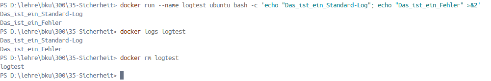

---

## Überwachen und Benachrichtigen
Gibt Überblick über Ressourcen (CPU, RAM, Speicher...)
Ermöglicht frühzeitige Warnungen bei Problemen
Tool: Google cAdvisor --> Container-based, mit Web-UI (Port 8080)
Starten von cAdvisor mit folgendem Command

```bash
docker run -d --name cadvisor -v /:/rootfs:ro -v /var/run:/var/run:rw -v /sys:/sys:ro -v /var/lib/docker/:/var/lib/docker:ro -p 8080:8080 google/cadvisor:latest
```  
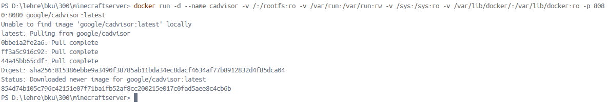


---

## Container sichern und Beschränken
### Sicherheitsrisiken:
- Kernel Exploits (durch gemeinsamer Kernel)
- Dos-Angriffe (Durch anspruch einer Ressourcce für sich alleine)
- Container-breakouts (meist durch Fehler im Anwendungscode)
- Vergiftete Images (Durch vorgefertigte Images)
- Geheimnisse geleakt (Zugriffe auf API-Keys oder Passwörter oder so)
### Effektives Prinzip
Least Privilege (Alles was nötig ist aber so wenig wie möglich)

---

### Wichtige Massnahmen
- Nicht als root laufen lassen
- Eigener User im Dockerfile
- Images verifizieren (per Hash)
- Nur die nötigsten Ports öffnen
- Einziger öffentlicher Zugriff Reverse Proxy
- Immer aktuellste Software nutzen
- Debug Modus deaktivieren
- AppArmor / SELinux aktivieren
- Secrets schützen (Passwörter, API-Keys)
- Regelmässige Audits  

---

### Ressourcen beschränken
- Speicher begrenzen mit `-m`
- CPU gewichtiung mit `-c`
- Restart Limits setzen mit `--restart=on-failure`
- Read-Only Filesysteme machen mit `--read-only`
- Capabilities einschränken mit `--cap-drop`
- Auf die Prozesse grenzen für den User setzen mit `ulimit`

---

### Wichtige Tipps
- Docker Zugriff --> Root zugriff auf Host
- Docker API absichern
- Multitenancy --> getrennte Hosts
- User mit weniger Berechtigungen erstellen
- Netzwerkzugriff beschränken
- setuid und setgid entfernen (meist nicht genutzt)
- Ressourcen einschränken (wie oben gesagt)

---

## Kontinuierliche Integration

### Ziel
- Automatisiert Bauen und Testen
- Qualität steigern

### Grundsätze
- Gemeinsame Codebasis
- Automatisiert builden
- Automatisiert testen
- Häufige Integration
- Produktsnahe Umgebung
- Automatisiertes Reporting

### CI Tools
#### Travis CI 
- Cloud based
- GitHub integration
#### Jenkins
- Open Source CI-Server
#### Blue Ocean
- Moderne Jenkins-Oberfläche
- Docker-based installation möglich

### CI mit Docker
- Pipeline via Jenkinsfile
- Automatisierter Build
- Automatisierte Tests
- Automatisierte Docker-Image-erstellung
- Images prüfen mit `docker image ls`
- Anwendung testen mit `docker run`

# Fragen

### Warum sollten Container überwacht werden?
- Damit Ressourcenüberlastung und Fehler frühzeitig erkannt werden

### Was ist das syslog und wo ist es zu finden?
- Das Logsystem eines Linux Hosts. --> Im verzeichnis var/log.

### Was ist stdout, stderr, stdin?
- Standard Output, Standard Error ausgabe, Standard Input eingabe

### Wie kann `docker run -v /:/homeroot -it ubuntu bash` durch Normale User verhindert werden?
- Wenn nur `root` den Container starten kann

### Wie können verschiedene Mandanten getrennt werden?
- Mit VMs

### Wie kann der Ressourcenverbrauch von Containern eingeschränkt werden?
```bash
--cpus=<value>
--cpu-period=<value>
--cpu-quota=<value>
--cpuset-cpus
--cpu-shares
docker run -it --cpus=".5" ubuntu /bin/bash
docker run -it --cpu-period=100000 --cpu-quota=50000 ubuntu /bin/bash
```

### Welche Funktionen kann Jenkins übernehmen?
- CI, Modultests, Software bauen, Batch Jobs ausführen 

### Wie baut man Modultests?
- Via Bash Scripts

### Wie anders, als Manuell oder Zeitgesteuert könnten Jenkins Jobs auch gestartet werden?
- Mit Änderungen im Git Repository

---

# 40 Kubernetes
# Readme
## Grundbegriffe
### Service Discovery
#### Definition:
Prozess um Verbindungsinfos einer Service-Instanz zu erhalten

#### Herausforderung:
Komplex in verteilten Systemen wegen dynamischen starten/ stoppen von Instanzen

#### Funktionsweise:
Client fordert Service an --> Backend sendet verfügbare Daten

#### Vernetzung:
Fokus auf verknüpfen von Containern (vor allem bei Webservern)

#### Zusatzfunktionen:
Health Checking, Failover, Load Balancing, Verschlüsselung und Gruppen-Isolierung

### Lastverteilung
#### Zweck:
Verteilung von umfangreichen berechtigungen oder hoher Anfragemengen auf mehrere parallel arbeitende Systeme.  

#### Nutzen:
Überwinden von Kapazitätsgrenzen bei einzelnen Hosts.  

#### Fokus:
Gezieltes Verteilen von anfragen an verschiedene Container-Instanzen.  

### Cluster
#### Definition:
Rechenverbund aus vielen vernetzten Computern.  

#### Ziele:
- Erhöhung der Rechenkapazität
- Erhöhung der Verfügbarkeit

## Kubernetes
### Allgemeines
#### Definition
Open-Source-System zum Automatisieren von Bereitstellungen, Skalierung und Verwaltung von Container Anwendungen.  

#### Ursprung
Ursprünglich von Google, jetzt von Cloud Native Computing Foundation.  

#### Support
Unterstützt verschiedene Container Tools und Cloud Plattformen.  

### Merkmale
#### Immutable Infrastructure:
Unveränderliche statt veränderlichen Systeme.  

#### Deklarativ:
Zielzustand wird definiert, nicht die einzelnen Ausführungsschritte.  

#### Self Healing:
Automatische Neustarts bei Abstürzen.  

#### Skalierbarkeit:
Anpassung der Instanzzahl durch einfache Änderung der Deklaration.  

#### Abstraktion:
Denken in Anwendungen und Services statt in physischen Rechnern oder technischer Infrastruktur.  

### Objekte
#### Pod:
Kleinste Einheit; Gruppe von Containern und Volumes in einer gemeinsamen Umgebung.  

#### ReplicaSet:
Garantiert, dass die definierte Anzahl an Pod-Kopien dauerhaft läuft.  

#### Deployment:
Erlaubt deklarierte Updates von Pods.  

#### Service:
Bietet stabilen Zugriff auf Pods auch wenn diese ersetzt werden.  

#### Ingress:
Fungiert als Reverse Proxy und ermöglicht den Zugriff auf Services via URL.  

---

# Fragen
## Kubernetes
### Was ist Kubernetes?
Die derzeit populärste Container-Cluster-Lösung/ Orchestrierungs-Lösung

### Was ist die Hauptaufgabe von Kubernetes?
Die Verwaltung und Orchestrierung der Container innerhalb eines Clusters

### Wer ist der Eigentümer von Kubernetes?
Die Cloud Native Computing Foundation

### Was für eine Netzwerkstruktur verwendet Kubernetes?
Sehr flach. jeder Container kann mit allen anderen reden, Jeder Node kann mit allen Container reden und das alles ohne NAT

### Über was Kommunizieren die Services von Nodes zu Nodes
Über ein Overlay Netzwerk

## Objekte
### Kubernetes Objekte (Ressourcen) werden im welchen Dateiformat beschrieben?
YAML

### Kubernetes Objekte (Ressourcen) können mittels Dashboard und welche CLI Tool verwaltet werden?
kubectl

### Mit was lassen sich Kubernetes Objekte (Ressourcen) gruppieren?
Labels

### Was sind Pods?
Kleine Gruppe eng verbundener Container

### Was sind Services?
Eine Gruppe von Pods die zusammenarbeiten, Gruppiert mittels Label Selector

### Was ein Ingress?
Ein API-Objekt, das den externen Zugriff auf die Dienste in einem Cluster verwaltet

### Was sind Namespaces bzw. deren Aufgabe?
Sie Unterteilen den gesamten K8s Cluster in logische Partitionen

### Was ist die Aufgabe eines ReplicaSets?
Stellt sicher, dass N Pods laufen sind es zu wenig, werden neue gestartet, sind es zu viele werden Pods beendet, gruppiert durch den Label Selector

### Für was können Deployments verwendet werden?
Ermöglichen Deklarative Updates von Container Images in Pods.

---

# KS8

## Kubernetes auf Docker installieren
Bei Settings auf Kubernetes und enable Kubernetes drücken. Den Haken bei Show system Containers (advanced) setzen.
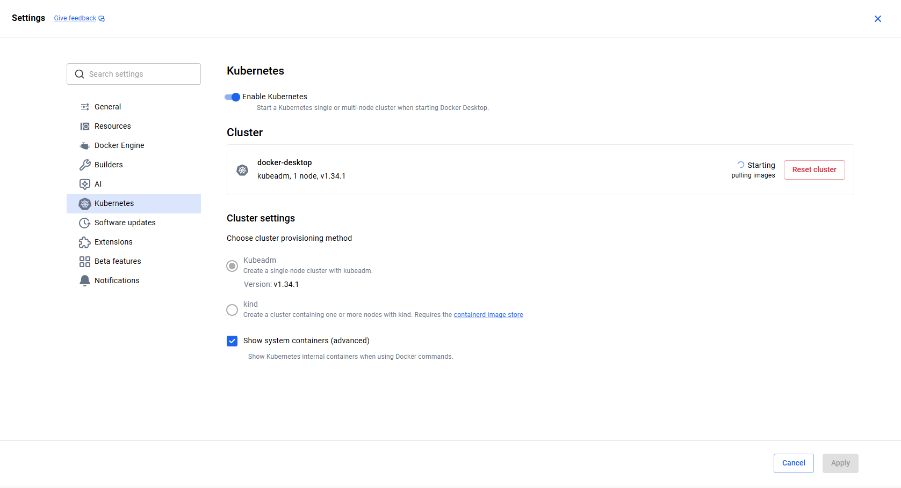

Und im Terminal mit `Kubectl version` schauen ob es installiert wurde.

Danach ein Kubernetes erstellen mit`kubectl create namespace m300`  

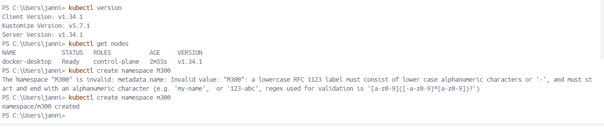
 Und mit `kubectl run apache --image=httpd --restart=Never -n m300` den Apache Webserver starten  

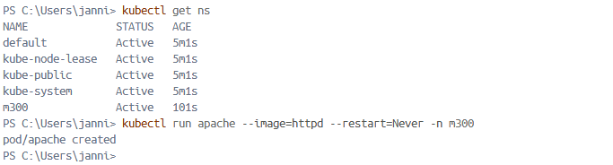

Und mit `kubectl get pods -n m300` testen und mit `kubectl expose pod apache --type=NodePort --port=80 -n test` den Service Starten

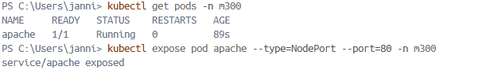

Und mit `kubectl get svc -n m300` den Port herausfinden und mit localhost:30523 darauf verbinden
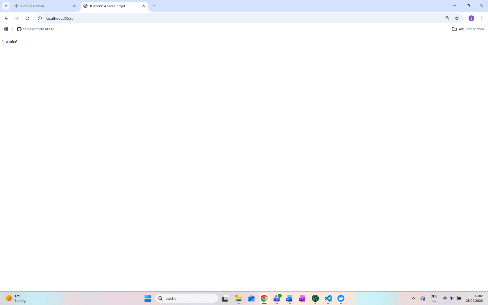

Nun speichere ich mit den zwei folgenden Commands die Beschreibung für die laufenden Apache Pods und für den Netzwerkzugriff.  
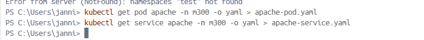

Danach um das ganze zu testen lösche ich all die Dateien die ich gerade gemacht habe mit dem folgenden Command  
```bash
kubectl delete namespace m300
```

Danach bereinige ich die apache-pod.yaml und schreibe nur das folgende rein.  
```bash
apiVersion: v1
kind: Pod
metadata:
  name: apache
  labels:
    run: apache 
spec:
  containers:
  - name: apache
    image: httpd
    imagePullPolicy: Always
  restartPolicy: Never
```

In die apache-service.yaml schreibe ich das folgende rein.  
```bash
apiVersion: v1
kind: Service
metadata:
  name: apache
  labels:
    run: apache
spec:
  type: NodePort
  selector:
    run: apache 
  ports:
  - port: 80
    targetPort: 80
    nodePort: 30523 
```

Danach mache ich wieder einen neuen namespace und darin alles wieder neu mit den Dateien mit den folgenden Commands.  
```bash
kubectl create namespace m300

kubectl apply -f . -n m300
```

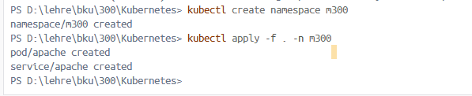

Dann kann ich auf localhost::30523 gehen und bin wieder auf der Apache Seite

---

# 50 Projekt
# Beschreibung
Ich mache als Projekt einen Minecraft Server und dazu möchte ich ein Dashboard machen in dem man sehen kann welcher Spieler wie oft gestorben ist.

---

# Erstellung
- Neues Verzeichnis erstellen 
- darin das vorgegebene compose.yaml abspeichern 
- Server erstellen und Starten

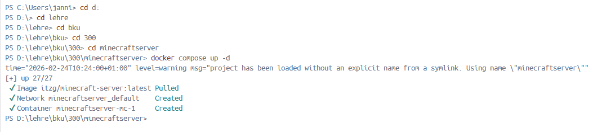

- Neue Minecraftinstanz im Launcher machen und starten.  
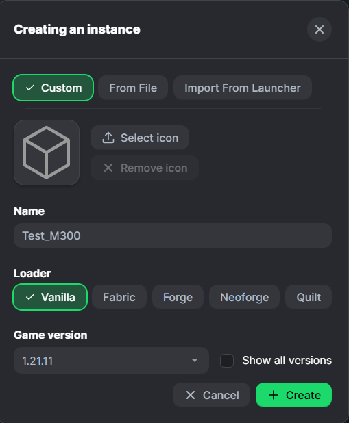

In Minecraft neuen Server mit localhost:25565 hinzufügen
Auf den Server joinen    
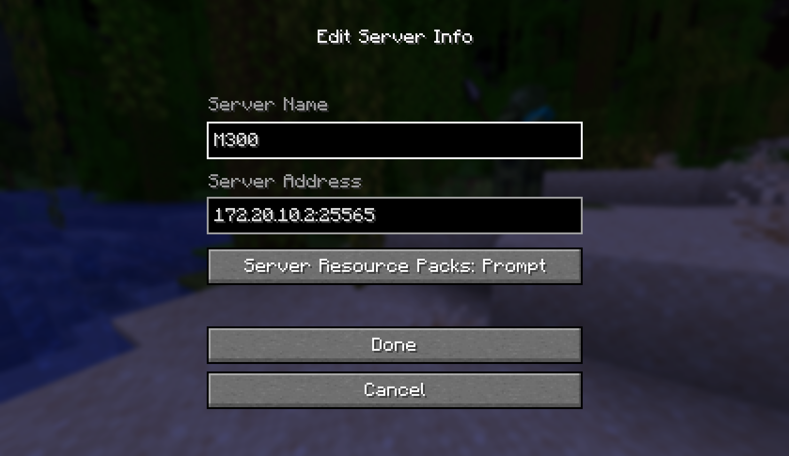

---

# Verzeichnis erstellen
Neue Ordner erstellen für die Plugins zum Auslesen der Daten  


Im Ordner Prometheus eine Datei prometheus.yml machen mit den folgenden Inhalten
```bash
global:
  scrape_interval: 15s

scrape_configs:
  - job_name: 'minecraft'
    static_configs:
      - targets: ['mc:18080']
```
und im Ordner grafana ein Ordner dashboards erstellen.

Das Plugin Prometheus Exporter herunterladen und in den Ordner Plugins legen. 
Die Compose.yml wie folgt anpassen  
```bash
services:
  mc:
    image: itzg/minecraft-server:latest
    container_name: mc_server
    ports:
      - "25565:25565"
    environment:
      EULA: "TRUE"
      TYPE: "PAPER"
    volumes:
      - ./data:/data

  prometheus:
    image: prom/prometheus:latest
    container_name: prometheus
    volumes:
      - ./prometheus/prometheus.yml:/etc/prometheus/prometheus.yml
    ports:
      - "9090:9090"

  grafana:
    image: grafana/grafana:latest
    container_name: grafana
    ports:
      - "3000:3000"
    volumes:
      - ./grafana:/var/lib/grafana
    environment:
      - GF_SECURITY_ADMIN_PASSWORD=Bananen123.
```
Um das Dashboard zu machen auf localhost:3000 gehen
Dann kommst du auf die Seite von Grafana  
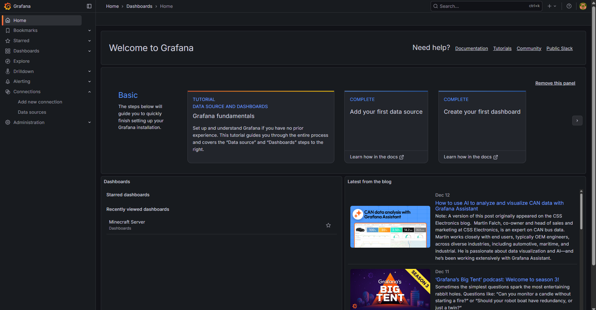

Unter Connections eine neue Data source hinzufügen und prometheus auswählen
Dann bei Prometheus Server URL http://prometheus:9090 eingeben und unten speichern  
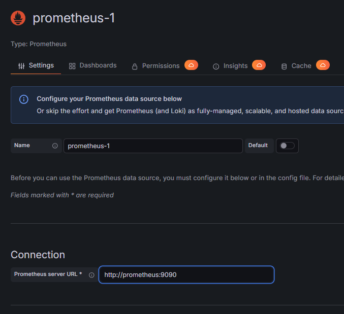

Das macht dass man Daten von Prometheus ziehen kann.
Danach kann man ein neues Dashboard machen und eine Visualizion machen.
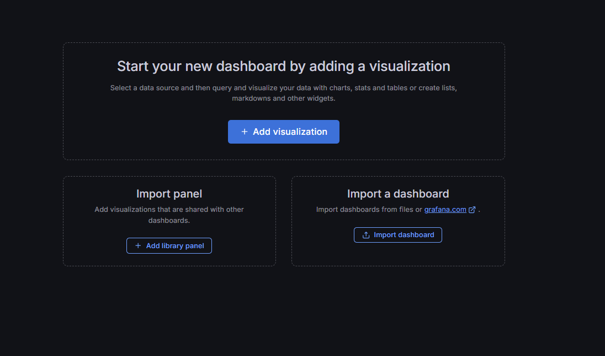

---

# Troubleshoot Metrics

Als Datasource Prometheus auswählen und dann kann man metrics von da ziehen und Darstellen.  
Bei mir hat das allerdings nicht funktioniert. Ich konnte keine metrics auswählen.  
Nach kurzem Recherchieren fand ich heraus dass ich einen metrics daten exporter brauche.  
Ich habe mich für Prometheus exporter entschieden.  
Dieses herunterladen und in Plugins Ordner ziehen.
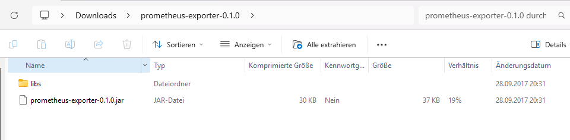

Danach den Server neu starten. Der Server hat jetzt einen Ordner erstellt in den ich den Libs Ordner in diesen Ordner reingezogen.  
Danach habe ich es wieder versucht aber ich konnte immer noch keine Metrics ziehen.   
Auf localhost:9090 --> Prometheus steht bei Target immer down obwohl der Server eingeschaltet ist.  
--> Der Server kann von Prometheus nicht ausgelesen werden.  
Nach kurzem Recherchieren habe ich mal eine neue Ordnerstruktur angewendet wie folgt
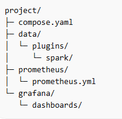

Im prometheus.yml habe ich den folgenden Code geschrieben:  

```bash
global:
  scrape_interval: 5s

scrape_configs:
  - job_name: "minecraft"
    static_configs:
      - targets: ["mc:18080"]
```  
Das heisst dass es alle 5 sekunden ein Update holt, der Job Minecraft heisst und es über den Port 18080 zugreifen soll.  
Das Compose.yml habe ich wie folgt angepasst um den Port 18080 zu öffnen:

```bash
services:
  mc:
    image: itzg/minecraft-server:latest
    pull_policy: daily
    tty: true
    stdin_open: true
    ports:
      - "25565:25565"
      - "18080:18080"
    environment:
      EULA: "TRUE"
      TYPE: "PAPER"
    volumes:
      - ./data:/data

  prometheus:
    image: prom/prometheus:latest
    ports:
      - "9090:9090"
    volumes:
      - ./prometheus/prometheus.yml:/etc/prometheus/prometheus.yml
    depends_on:
      - mc

  grafana:
    image: grafana/grafana:latest
    ports:
      - "3000:3000"
    volumes:
      - ./grafana:/var/lib/grafana
    depends_on:
      - prometheus
```
Danach den Server wieder aufstarten
Nachdem ich die Logs angeschaut habe habe ich etwas gemerkt:  

`mc-1 | [10:08:56 INFO]: [spark] This server bundles the spark profiler. For more information please visit`  
Dass das Plugin Spark welches ich verwenden wollte neu schon integriert ist in Minecraft Paper Servern.  
Der Server sollte jetzt einen Ordner erstellt haben für Spark. Das hat dieser allerdings nicht gemacht.  
Also habe ich den Server gestoppt und den Ordner manuell erstellt in data --> config --> spark --> config.conf  
Und in diese Datei den folgenden Code geschrieben:
```bash
metrics {
  enabled = true
  type = prometheus
  address = 0.0.0.0
  port = 18080
}
```

Danach den Server wieder starten und versuchen auf localhost:18080 zu gehen.
Das hat allerdings nicht funktioniert und die Seite hat nicht geladen.
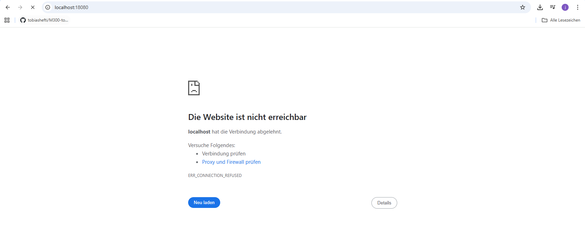

Das heisst dass das Plugin Spark zwar funktioniert aber der Web/Metrics-Server dazu nicht.  
Um diesen Webserver zu starten habe ich in der Datei paper-global.yml folgenden Text in den block Spark reinkopiert:
```bash
spark:
  enabled: true
  profiler:
    enabled: true
  web-server:
    enabled: true
    bind-address: 0.0.0.0
    port: 18080
```
Das definiert noch dass der Webserver an ist, dass man von überall drauf kann und zwar über Port 18080.  
Allerdings hat das wieder nicht funktioniert. Der Webserver blieb unerreichbar. 
Nach kurzer Recherche habe ich herausgefunden dass diese Schreibweise veraltet ist und ich die folgenden benutzen muss.
```bash
metrics:
  enabled: true
  endpoint:
    enabled: true
    bind-address: 0.0.0.0
    port: 18080
```
Allerdings ist auch das leider wieder veraltet und ich musste nach einer anderen Lösung suchen. 
Ich habe keine andere Lösung gefunden also habe ich mich entschieden es nochmal mit Prometheus Exporter zu probieren.  
Ich habe es nochmal neu heruntergeladen und in den Ordner Plugins verschoben.  
Danach habe ich das prometheus.yml wie folgt angepasst.
```bash
global:
  scrape_interval: 15s

scrape_configs:
  - job_name: 'minecraft'
    static_configs:
      - targets: ['mc:18080']
```
Und das Compose.yml mit dem folgenden überschrieben:
```bash
services:
  mc:
    image: itzg/minecraft-server:latest
    container_name: mc
    ports:
      - "25565:25565"
    environment:
      EULA: "TRUE"
      TYPE: "PAPER"
    volumes:
      - ./data:/data

  prometheus:
    image: prom/prometheus:latest
    container_name: prometheus
    volumes:
      - ./prometheus/prometheus.yml:/etc/prometheus/prometheus.yml
    ports:
      - "9090:9090"

  grafana:
    image: grafana/grafana:latest
    container_name: grafana
    ports:
      - "3000:3000"
    volumes:
      - ./grafana:/var/lib/grafana
    environment:
      - GF_SECURITY_ADMIN_PASSWORD=admin 
```
Danach habe ich mich wieder auf Grafana verbunden und Prometheus verbunden.
nach kurzem Recherchieren sollte ich einen Ordner Prometheus_Exporter im Plugin ordner finden, welcher nicht vorhanden war.  
Das Problem war dass ich für mein Plugin einen Unterordner erstellt habe mit den anderen Dateien die ich dazu bekommen habe.  
Ich habe diesen direkt in den Plugins Ordner verschoben und den Server neu gestartet. 
Dann war der Ordner endlich vorhanden und ich habe den Libs Ordner da rein verschieben können und die Datei config.yml wie folgt anpassen
```bash
port: 18080
enable_node_exporter: true
enable_connection_exporter: true
```
Danach habe ich mich wieder auf Prometheus verbunden. Aber der Server stand da immer noch auf Down. 
Ich habe in allen Dateien nochmal die Ports überprüft und mich versucht auf localhost:18080/metrics zu verbinden.  
Aber ich bekomme immer noch keine verbindung.  
Da es nicht funktioniert habe ich es mal mit dem Port 9225 probiert.  
Aber das hat auch nichts gebracht.  Ich habe anscheinend eine alte version von PrometheusExporter gehabt.  
Ich habe aber keine neuere gefunden also habe ich mit UnifiedMetrics weitergemacht.   
Ich habe die .jar Datei heruntergeladen und in Plugins kopiert.  
Allerdings hat es hier auch keinen Ordner erstellt mit der config.yml. Stellt sich raus die Datei ist nur für bis und mit 1.19.4.  
Ich habe aber die 1.21.10 genutzt. Also habe ich den Server down gegradet.  
Dafür musste ich den config, World und einige andere Ordner löschen damit nichts mit der neuen Version übrig bleibt.  
Dann habe ich den Server neu gestartet.  
Dann ist die config.yml erschienen und ich habe sie im Block Prometheus wie folgt angepasst.
```bash
api:
  host: 0.0.0.0
  port: 18080

drivers:
  prometheus:
    enabled: true
```
Die Datei speichern und bei den anderen Dateien alle Ports wieder auf 18080 zurückstellen den Server neu starten.  
Auf localhost:18080/metrics verbinden versuchen. Das hat allerdings auch nichts gebracht.  
Danach habe ich mit `docker exec -it mc curl http://localhost:18080/metrics` prüfen wollen ob der Port wirklich offen ist.  
Allerdings hat es den command curl nicht erkannt.  
Das hat nachdem ich von der latest version auf java21 umgestellt habe auch funktioniert. 
Allerdings hat es trotzdem keine verbindung gegeben.  
Danach habe ich mit `docker exec -it mc netstat -tulpn` geschaut welche Port alle offen sind.  
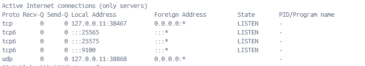
Da trotzdem alles wieder nicht funktioniert hat, habe ich gedacht dass mit Java21 vielleicht spark funktioniert. 
Also habe ich die .jar Datei von Spark heruntergeladen und in den Ordner Plugins gelegt.  
nach einem Neustart ist der Ordner Spark erschienen in dem ich die Datei config.json wie folgt angepasst.  
```bash
{
  "_header": "spark configuration file - https://spark.lucko.me/docs/Configuration",
  "backgroundProfiler": true,
  "prometheus-exporter": {
    "enabled": true,
    "host": "0.0.0.0",
    "port": 18080
  }
}
```
Diese Datei speichern und Server neu starten. Allerdings war danach der Port 18080 immer noch nicht geöffnet.  
Es liest also die Datei nicht richtig oder es wird immer wieder überschrieben.  
Ich habe nochmal alles möglich versucht allerdings wollte der Port 18080 einfach nicht aufgehen. 
Also habe ich alles gelöscht und nochmal ganz von vorne begonnen.
Ich habe erst mal eine neue Ordnerstruktur gemacht.  
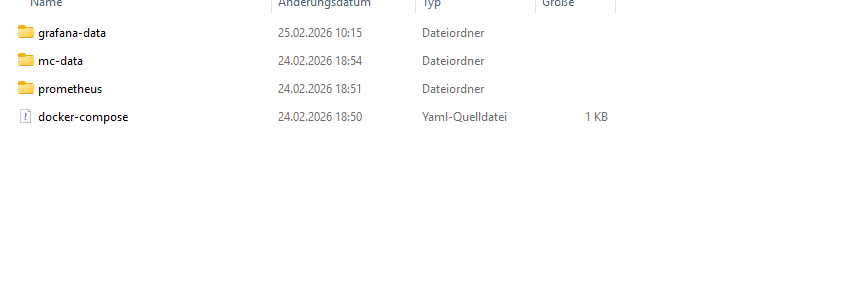
Danach habe ich ein neues docker-compose.yml gemacht mit folgenden Inhalten  
```bash
services:
  mc:
    image: itzg/minecraft-server
    container_name: mc-server
    ports:
      - "25565:25565"
    environment:
      EULA: "TRUE"
      TYPE: "PAPER" 
      MEMORY: "2G"
      PLUGINS: "https://github.com/sladkoff/minecraft-prometheus-exporter/releases/download/v2.3.0/minecraft-prometheus-exporter-2.3.0.jar"
    volumes:
      - ./mc-data:/data
    restart: unless-stopped

  prometheus:
    image: prom/prometheus
    container_name: prometheus
    volumes:
      - ./prometheus/prometheus.yml:/etc/prometheus/prometheus.yml
    ports:
      - "9090:9090"
    restart: unless-stopped

  grafana:
    image: grafana/grafana
    container_name: grafana
    ports:
      - "3000:3000"
    environment:
      - GF_SECURITY_ADMIN_PASSWORD=admin
    volumes:
      - ./grafana-data:/var/lib/grafana
    restart: unless-stopped
```
In Prometheus habe ich die Datei prometheus.yml mit folgenden Inhalt gemacht.
```bash
global:
  scrape_interval: 5s 

scrape_configs:
  - job_name: 'minecraft'
    static_configs:
      - targets: ['mc:8000']
```
Danach habe ich den Server gestartet und mich auf localhost:3000 verbunden und Prometheus mit Grafana verbunden.  
Das hat funktioniert aber bei Prometheus hat es den Server immer noch als down angegeben.  
Also habe ich mit `docker logs mc-server | Select-String "Prometheus"` alle logs von Prometheus angeschaut.
Da habe ich festgestellt dass ich durch die Einstellungen wahrscheinlich nur von localhost drauf komme.  
Da ich abe nicht im Container bin geht das nicht also habe ich folgende Zeilen im Config.yml hinzugefügt.  
```bash
host: 0.0.0.0
port: 9225
```
Die Datei gespeichert und den Server neu starten und im prometheus.yml den Port auf 9225 ändern.  
Danach mit `docker restart prometheus` nur Prometheus neu starten und kurz warten bis alles gestartet ist.  
Danach kann ich auf localhost:9090/targets den Server sehen und er ist Up.  

---

# Dashboard erstellen

Jetzt kann ich bei Grafana beginnen das Dashboard zu gestalten.  
Ich mache 4 Panels mit TPS, Anzahl an Spieler Online pro Dimension, Anzahl Tode pro Spieler, und benutzte RAM vom Server.  
Für das erste Panel mit TPS wähle ich bei metrics mc_tps und stelle es als Gauge dar.
Für das Panel mit Spieler Online wähle ich mc_player_online_total und stelle es auch als Stats dar.
Für das Panel mit Anzahl an spieler muss ich erstmal noch im PrometheusExporter config.xml diese Einstellungen ergänzen.  
```bash
enable_node_exporter: true
enable_connection_exporter: true
collect_player_statistics: true
```
Dann kann ich code auswählen und `mc_player_statistic{statistic="DEATHS"}`eingeben um die Tode anzuzeigen, und zeige es als Bar Chart an.  
Für das Panel mit RAM gehe ich auf code und geben `mc_jvm_memory{type="allocated"} - on() mc_jvm_memory{type="free"}` ein.  
Das rechnet die reservierten RAM minus den freien RAM um den benutzten zu bekommen. Das stelle ich als Stat dar.
Danach mache ich noch ein paar Einstellungen um alles etwas besser aussehen zu lassen.   
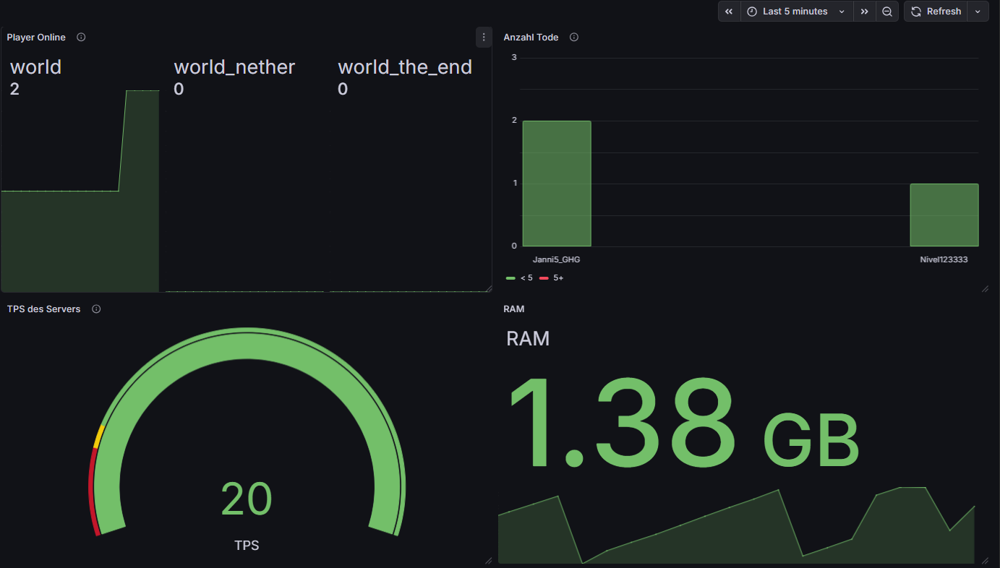  
Am Ende ist die Theorie dahinter etwa das.  
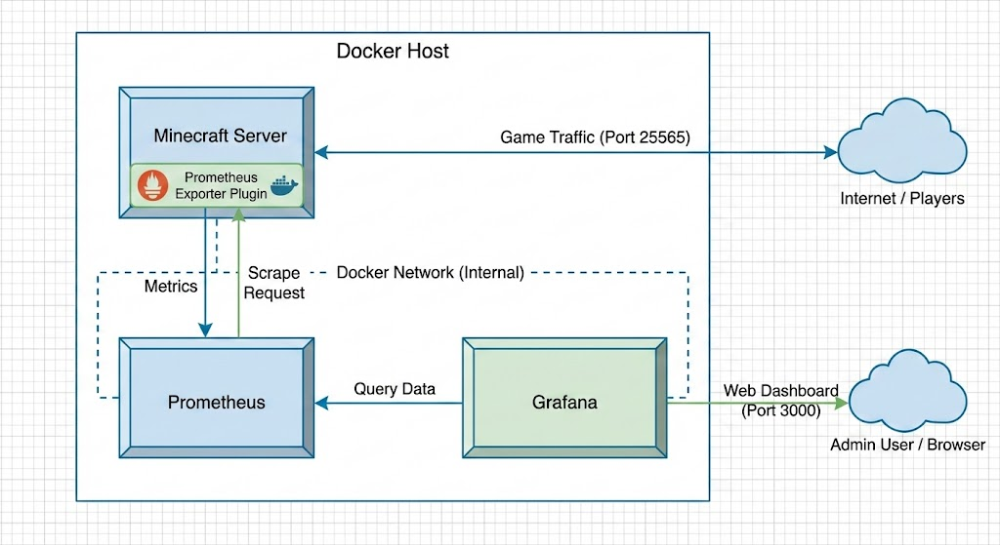

---

# Mehrspieler Testen

Um das mit verschiedenen Spieler zu testen habe ich ein Tunnel erstellt.  
Dafür habe ich Playit.gg genutzt. 
Auf der Website playit.gg anmelden und `neuen Agent machen` ausählen
Die Datei herunterladen und ausführen. Durchklicken und danach die Applikation Playit.gg ausführen.  
Sich auf die angegebene Website verbinden und warten bis der Agent authentifiziert wurde.  
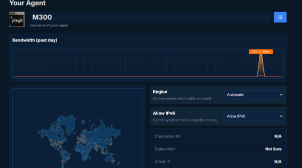

Auf der Playit.gg Website ein neues Tunnel machen und durchklicken.  
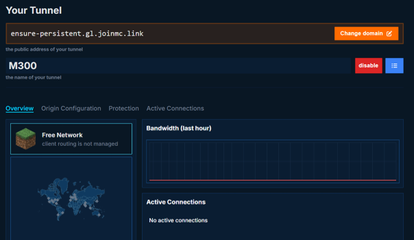

Der angegebene Link kopieren und an Mitspieler weitergeben
Dieser trägt ihn bei Neuer Server unter IP ein. Dann kann er joinen.  

